# AM-USB Modulation and Coherent Demodulation

> Section A, Part 1 of the TC60056E Communications Systems coursework — University of West London. Mustafa Yaqoobi.

## 1.1 Introduction

Upper Single Sideband (USB) is an amplitude modulation scheme that transmits only the upper sideband and suppresses both the carrier and the lower sideband. Because conventional AM wastes power on a carrier that carries no information and transmits the same message twice (once per sideband), USB halves the bandwidth and concentrates the transmitted power into a single sideband instead of splitting it between two. It is commonly used in HF radio and aviation voice communications.

This section implements an AM-USB system using a 1 kHz message and 700 kHz carrier. The design uses the phase-shift (Hilbert transform) method, simulated in SIMetrix and built on a breadboard afterwards to compare results.

## 1.2 Theory

### 1.2.1 Amplitude Modulation

In Amplitude Modulation (AM), the amplitude of a high-frequency carrier is modulated in proportion to a lower-frequency message signal. The carrier shifts the message to a frequency ideal for transmission over the channel.

The carrier is defined as:

$$c(t) = A_c \cos(2\pi f_c t)$$

and the message signal is:

$$m(t) = A_m \cos(2\pi f_m t)$$

The standard AM signal is:

$$s(t) = A_c [1 + \mu\, m(t)] \cos(2\pi f_c t)$$

where μ is the modulation index:

$$\mu = \frac{A_m}{A_c}$$

Since m(t) has a peak value of 1, μ directly controls the modulation depth. For this project:

$$A_m = A_c = 1\ \text{V} \quad\Rightarrow\quad \mu = 1$$

### 1.2.2 Sidebands

Modulating a carrier at $f_c$ with a message at $f_m$ produces two sidebands: an upper sideband at $f_c + f_m$ and a lower sideband at $f_c - f_m$. Both carry identical information, so transmitting just one — in this case the USB — is sufficient to recover the original message.

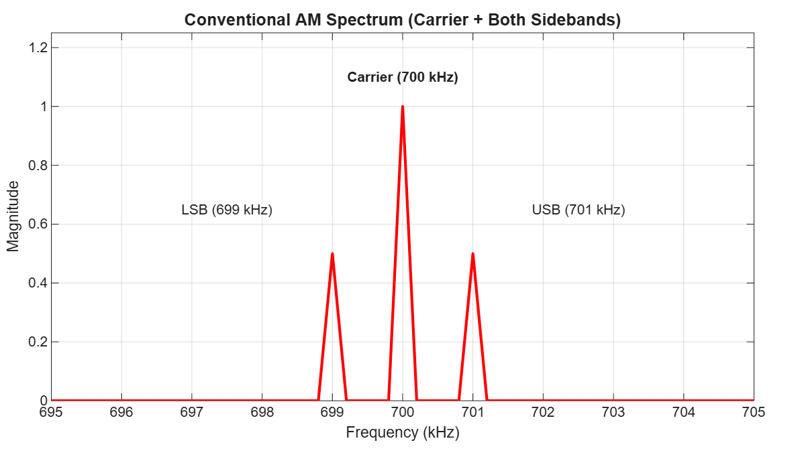

*Figure 1: DSB-LC spectrum showing both sidebands at 699 kHz and 701 kHz.*

### 1.2.3 SSB Modulation Process (Phase-Shift Method)

To produce a single-sideband signal, the system generates a Hilbert transform of the message, $\hat{m}(t)$, which is a 90°-shifted copy of m(t).

Two carrier signals are used: an in-phase carrier $\cos(2\pi f_c t)$ and a quadrature carrier $\sin(2\pi f_c t)$. The message is multiplied by the in-phase carrier:

$$m(t) \cos(2\pi f_c t)$$

and the Hilbert-transformed message by the quadrature carrier:

$$\hat{m}(t) \sin(2\pi f_c t)$$

For USB, the quadrature path is subtracted from the in-phase path:

$$S_{USB}(t) = m(t) \cos(2\pi f_c t) - \hat{m}(t) \sin(2\pi f_c t)$$

This cancels the lower sideband and the carrier, leaving only the upper sideband.

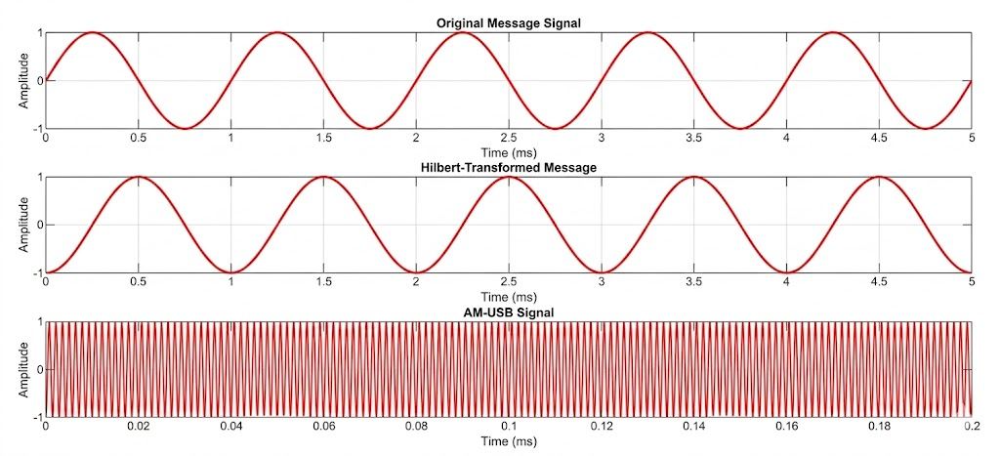

*Figure 2: SSB modulation process showing the original message, its Hilbert transform (90° phase shift), and the resulting AM-USB output.*

### 1.2.4 SSB Demodulation Process (Coherent Detection)

Demodulation of an SSB signal uses coherent detection, where the receiver generates a local carrier which has the same frequency and phase as the original carrier. The received signal is multiplied by this carrier:

$$r(t) \cos(2\pi f_c t + \phi)$$

This produces a baseband component and a mixing product at $2f_c$. Using trigonometric identities, the baseband component is:

$$\tfrac{1}{2} m(t) \cos(\phi) + \tfrac{1}{2} \hat{m}(t) \sin(\phi)$$

When the receiver's carrier is phase-aligned (φ = 0), this simplifies to:

$$\tfrac{1}{2} m(t)$$

A low-pass filter removes the $2f_c$ mixing product, leaving the recovered message at half its original amplitude. Unlike conventional AM, phase error in the local oscillator does not affect the recovered amplitude; for single-tone messages, it only shifts the phase of the output.

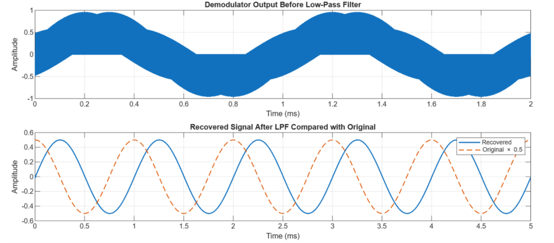

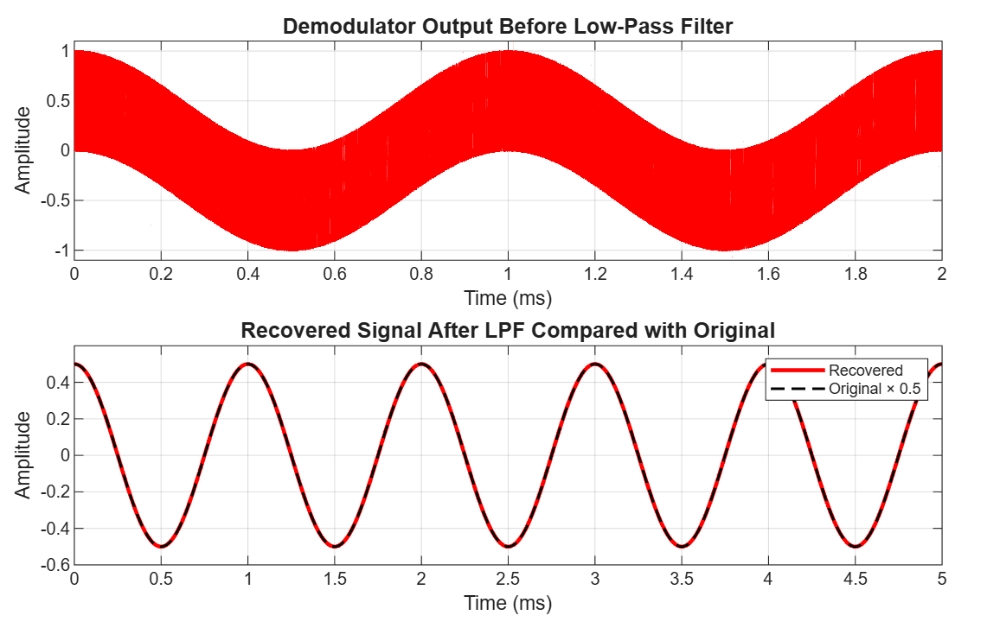

*Figure 3: Demodulator output before LPF and recovered signal overlaid with original × 0.5, proving ideal ½m(t) recovery.*

### 1.2.5 Modulation Index

The modulation index describes how deeply the message modulates the carrier:

$$\mu = \frac{A_m}{A_c}$$

It can also be measured from the signal envelope:

$$\mu = \frac{V_{max} - V_{min}}{V_{max} + V_{min}}$$

where $V_{max}$ and $V_{min}$ are the maximum and minimum values of the modulated signal envelope.

In standard AM, three cases happen:

- When μ < 1 the carrier's full dynamic range is not used, reducing SNR (signal-to-noise ratio).
- When μ = 1 the message uses the full carrier swing without distortion.
- When μ > 1 the envelope clips and phase reversals occur, causing harmonic distortion.

For this project:

$$A_m = A_c = 1\ \text{V} \quad\Rightarrow\quad \mu = \frac{A_m}{A_c} = \frac{1}{1} = 1$$

Since USB is a suppressed-carrier scheme, there is no carrier envelope to measure. The envelope formula and the under/over-modulation effects described above apply to standard AM only. In SSB modulation, μ defines the amplitude ratio used in the modulation process and does not affect the output in the same way.

### 1.2.6 Bandwidth

Bandwidth is the range of frequencies occupied by a signal in transmission:

$$BW = f_H - f_L$$

For conventional AM (DSB), both sidebands are transmitted, so the bandwidth is:

$$B_{DSB} = 2 f_m$$

For SSB, only one sideband is transmitted, halving the bandwidth:

$$B_{SSB} = f_m$$

For this project $f_m = 1\ \text{kHz}$, which gives a DSB bandwidth of 2 kHz and an SSB bandwidth of 1 kHz.

## 1.3 DSP Model Verification (MATLAB)

Before committing the design to SIMetrix and hardware, the SSB phase-shift method of §1.2 was verified numerically in MATLAB. This establishes an ideal baseline — the performance the method achieves with perfect components — against which the circuit results are later measured. The model implements the same chain as the hardware: a 1 kHz message and its 90° Hilbert-shifted copy, upper-sideband modulation onto a 700 kHz carrier via the I–Q phasing structure (I − Q), coherent demodulation, and an RC low-pass recovery filter.

### 1.3.1 Modulation and Hilbert Transform

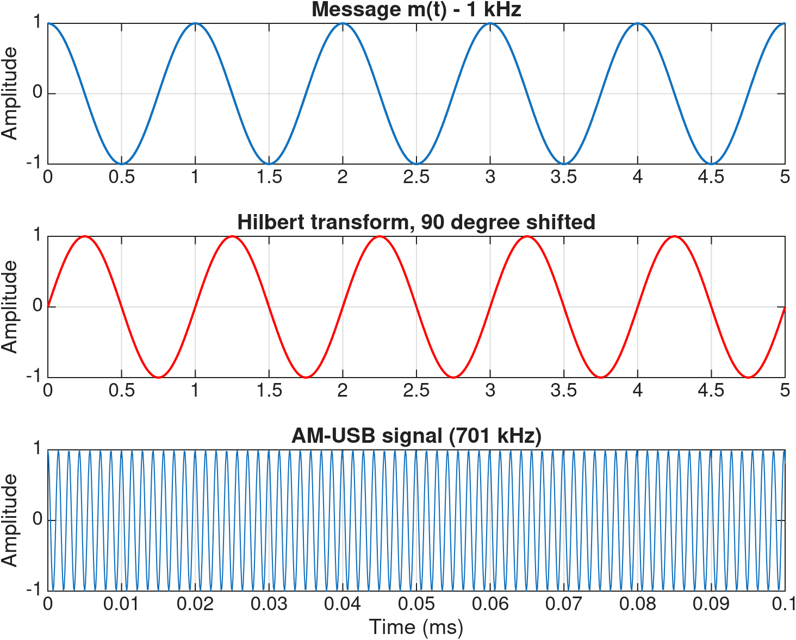

*Figure 4: MATLAB DSP model — 1 kHz message, its 90° Hilbert-shifted copy, and the resulting AM-USB signal.*

The I–Q phasing structure collapses algebraically to $\cos(2\pi (f_c + f_m) t)$ — a single tone at 701 kHz, the upper sideband only, with the lower sideband cancelled.

### 1.3.2 Transmit Spectrum

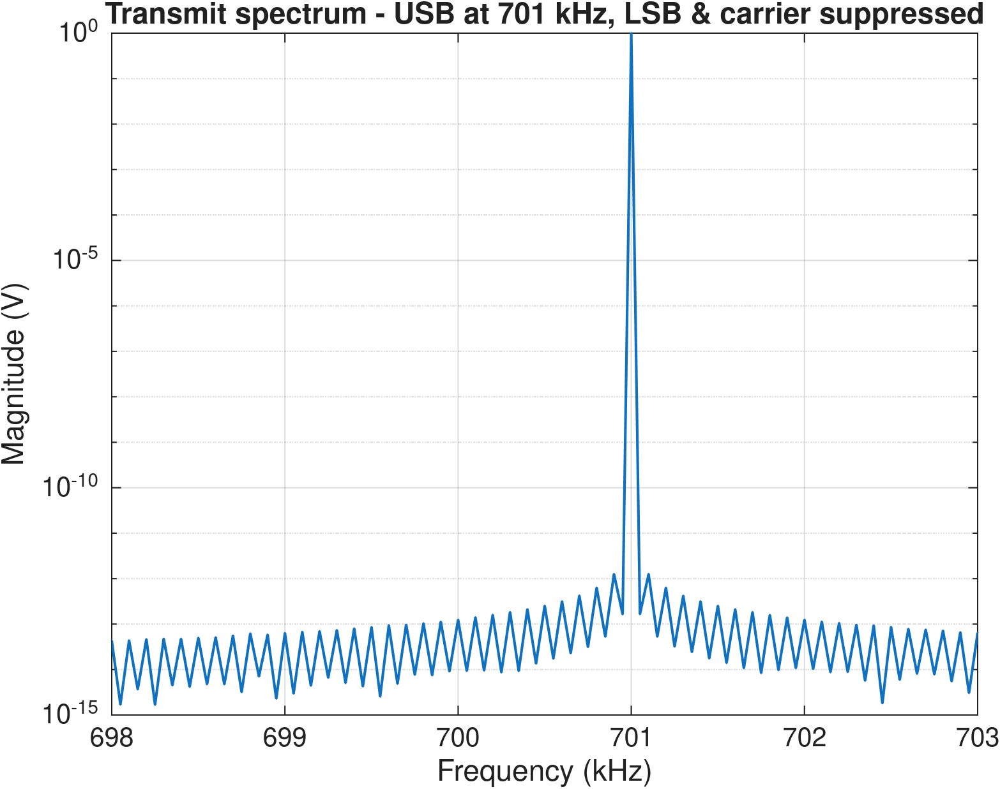

*Figure 5: MATLAB DSP model — transmit spectrum showing the USB at 701 kHz with the LSB and carrier suppressed.*

Sideband suppression in the ideal model is **≈ 263 dB** — effectively perfect, limited only by floating-point precision. This confirms the phase-shift method imposes no theoretical limit on sideband rejection; the ~52 dB measured on the circuit (§1.6) is therefore set by component tolerances, not by the method.

### 1.3.3 Coherent Recovery

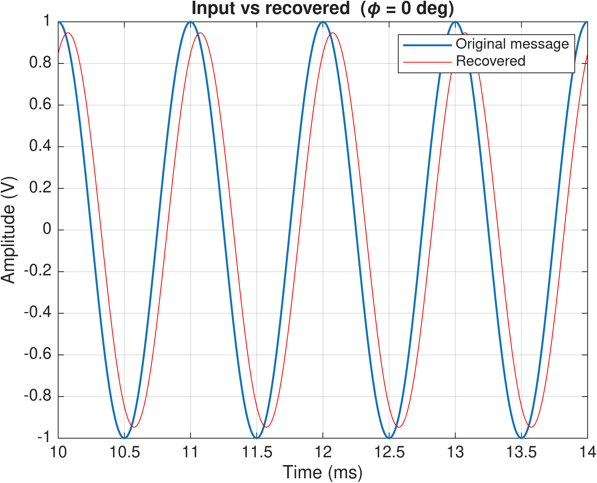

*Figure 6: MATLAB DSP model — original 1 kHz message and the coherently recovered output at φ = 0°.*

Multiplying the USB signal by a phase-locked local oscillator and low-pass filtering recovers the original 1 kHz message cleanly, validating the demodulator design.

### 1.3.4 Phase-Angle Experiment

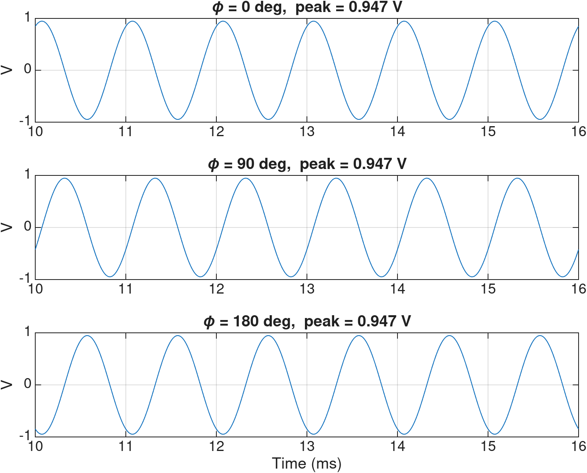

*Figure 7: MATLAB DSP model — recovered output at LO phases of 0°, 90° and 180°.*

A defining property of SSB is that the recovered **amplitude is preserved at every LO phase** — only the output phase rotates. The model confirms this: the recovered peak holds constant across 0°, 90°, and 180°, distinguishing SSB from DSB (where a 90° offset nulls the output). This validates the phase behaviour examined on the circuit in §1.7.

## 1.4 SIMetrix Simulation

The USB circuit was simulated in SIMetrix to check if the design would work with realistic component-level behaviour before committing to a breadboard. The modulator uses first-order RC networks for 90° phase shifting, two double-balanced mixers (centre-tapped transformers with BAS70-04 Schottky diodes), an LM6172 difference amplifier for sideband cancellation, and a VCVS for output gain. The demodulator uses the same mixer topology as a product detector, followed by a two-stage RC low-pass filter and a gain stage.

Although the modulator architecture uses both in-phase (I) and quadrature (Q) signal paths, this is not Quadrature Amplitude Modulation (QAM). QAM transmits two independent messages on a single carrier and the receiver recovers both. The architecture implemented here is the Hartley phase-shift method for SSB-AM (Hartley, 1928), in which a single message m(t) is processed through a Hilbert transform — approximated by ±45° RC networks at the design frequency — to produce two related signals: m(t) and m̂(t).

The expression:

$$s(t) = m(t) \cdot \cos(2\pi f_c t) - \hat{m}(t) \cdot \sin(2\pi f_c t)$$

This method mathematically cancels one sideband, producing a single-sideband AM signal carrying one message. The transmitted bandwidth equals the message bandwidth (1 kHz), confirming this is SSB and not QAM (which would occupy 2 kHz). (Hartley, R. V. L., "Modulation System," US Patent 1,666,206, filed 15 March 1925, granted 17 April 1928.)

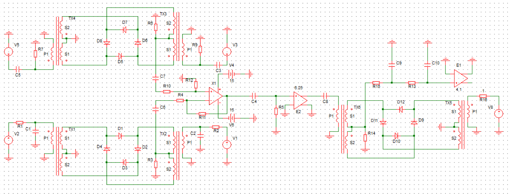

*Figure 25: SIMetrix full schematic diagram.*

### 1.4.1 RC Phase-Shift Networks

Each source signal is split into in-phase (I) and quadrature (Q) paths using first-order RC networks. At the design frequency, the low-pass RC configuration produces a −45° phase shift and the high-pass RC configuration produces +45°, giving a total 90° difference between I and Q. This quadrature relationship is what enables the difference amplifier to cancel one sideband in the next stage.

The carrier splitter is tuned to 700 kHz using R = 1 kΩ and C = 227.4 pF. The message splitter is tuned to 1 kHz using R = 10 kΩ and C = 15.915 nF. Both are designed using the standard RC frequency equation:

$$f = \frac{1}{2\pi RC}$$

For the carrier:

$$\frac{1}{2\pi \times 1000 \times 227.4 \times 10^{-12}} = 700.0\ \text{kHz}$$

For the message:

$$\frac{1}{2\pi \times 10000 \times 15.915 \times 10^{-9}} = 1000.0\ \text{Hz}$$

In each splitter, the I path takes the output across the capacitor (low-pass, −45°) and the Q path takes the output across the resistor (high-pass, +45°). The 45° phase shift is only exact at the design frequency, so this approach is valid for a single-tone message but would require a wideband Hilbert filter for broadband signals.

### 1.4.2 Double-Balanced Mixers

Two identical double-balanced mixers (DBMs) perform the signal multiplication. Each mixer consists of two centre-tapped ideal transformers and four BAS70-04 Schottky diodes arranged in a ring configuration.

The carrier path feeds the local oscillator (LO) transformer primary with its centre tap grounded. The message path feeds the RF transformer primary, with the RF centre tap serving as the intermediate frequency (IF), mixed signal, output. A 1 MΩ resistor between the IF output and ground provides a DC bias path.

All transformers use the same settings: one primary winding, two secondary windings forming a centre tap, 1:1 turns ratio, 100 mH primary inductance, and unity coupling coefficients. The 100 mH value was chosen after smaller inductances (e.g. 10 µH) presented near-zero impedance at 1 kHz ($Z = \omega L = 2\pi \times 1000 \times 10 \times 10^{-6} = 0.06\ \Omega$), shunting the message to ground instead of coupling it magnetically. At 100 mH, the impedance at 1 kHz rises to 628 Ω, enough to pass the message.

BAS70-04 Schottky diodes were chosen over standard 1N4148 signal diodes for their lower forward voltage (~0.3 V vs ~0.6 V), which reduces the dead zone around zero crossings and gives faster switching. All four diodes point in the same rotational direction around the ring to ensure correct polarity switching of the carrier.

The centre-tapped transformer topology is critical to achieving carrier suppression. In a properly balanced ring, the carrier signal appears as a common-mode voltage at the IF output and cancels. The earlier version of this circuit used single-secondary transformers, which could not achieve proper balance and the 700 kHz carrier appeared as the dominant spectral component (~10 mV) with the sidebands buried underneath. After switching to centre-tapped transformers, the carrier leakage dropped to approximately 8 µV, representing near-complete suppression.

Mixer 1 receives the I path outputs (carrier I and message I), and Mixer 2 receives the Q path outputs (carrier Q and message Q). Each mixer individually produces a DSB-SC signal containing both sidebands at 699 kHz and 701 kHz, with the 90° phase offset between them carried forward into the difference amplifier stage.

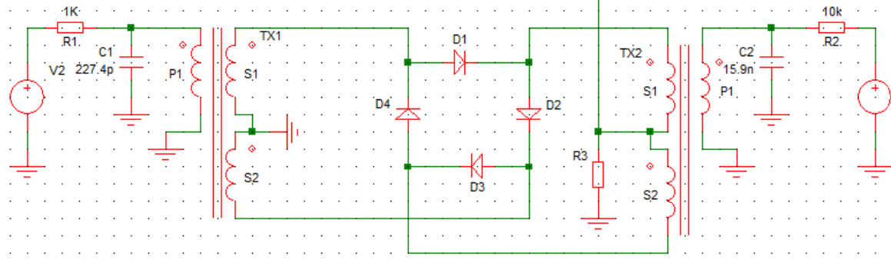

*Figure 26: I path DBM mixer.*

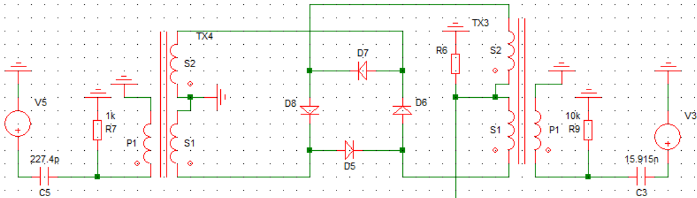

*Figure 27: Q path DBM mixer.*

### 1.4.3 Difference Amplifier

The outputs of both mixers go into a difference amplifier that performs the subtraction required for sideband cancellation. The LM6172 op-amp is configured as a standard four-resistor difference amplifier with all four resistors matched at 100 kΩ, powered from a ±15 V dual supply.

The LM6172 was chosen for its 100 MHz gain-bandwidth product, which gives a gain reserve of approximately 142× at 700 kHz (100 MHz ÷ 700 kHz). The initial design used a TL072 op-amp with only 3 MHz GBW, a reserve of just 4× at 700 kHz. This introduced phase errors that degraded the I/Q cancellation and reduced sideband suppression. The LM6172 eliminated the problem.

A 10 nF coupling capacitor in series with each mixer IF output blocks the DC offset produced by the diode rings, centring the signal at 0 V. Without these capacitors, the DC offset would be amplified and could drive the op-amp output to the supply rails.

The difference amplifier computes: `Output = Mixer 2 (Q path) − Mixer 1 (I path)`. Using the phase-shift method, this subtraction cancels the lower sideband components (699 kHz) which are in-phase between the two paths, while reinforcing the upper sideband components (701 kHz) which is 180° out of phase. The result is a USB signal with the carrier and lower sideband suppressed.

### 1.4.4 VCVS Gain Stage

The difference amplifier output is at millivolt level due to losses through the diode rings, transformers, and RC networks. To restore the amplitude of the signal, an ideal voltage-controlled voltage source (VCVS) with a gain of 6.25 amplifies the signal.

A VCVS was chosen instead of a second op-amp stage because the required gain of 6.25 exceeds the TL072's achievable gain at 700 kHz (~4.3×, see 1.4.3). The VCVS has no bandwidth limitation and provides ideal linear amplification. In a real hardware implementation, this stage would be replaced by a wideband RF amplifier or several cascaded gain stages.

A 10 nF coupling capacitor between the difference amplifier output and the VCVS positive input, with a 100 kΩ resistor to ground, blocks the residual ~4 mV DC offset that would otherwise be amplified to drive the output off-centre. The time constant (10 nF × 100 kΩ = 1 ms) allows the circuit to settle quickly.

The VCVS output is a 1.07 V peak signal centred at 0 V, with the 701 kHz upper sideband as the dominant spectral component.

### 1.4.5 Node Limit and Schematic Separation

SIMetrix Intro 7.20 imposes a hard limit on the number of analogue nodes in a single schematic. The modulator circuit alone — which has four RC networks, two double-balanced mixers with centre-tapped transformers, the LM6172 difference amplifier, and the VCVS gain stage — uses nearly all available nodes. Adding the demodulator exceeded this limit, producing a "Too many analog nodes" error.

To work around this, the circuit was split into two schematics. The modulator VCVS output was exported as a piecewise-linear (PWL) text file and imported into a second schematic as a voltage source for the demodulator. This preserves the exact modulator output waveform, ensuring the demodulator operates on a realistic input signal rather than an idealised carrier-modulated source.

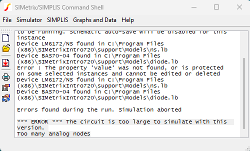

*Figure 28: SIMetrix error message.*

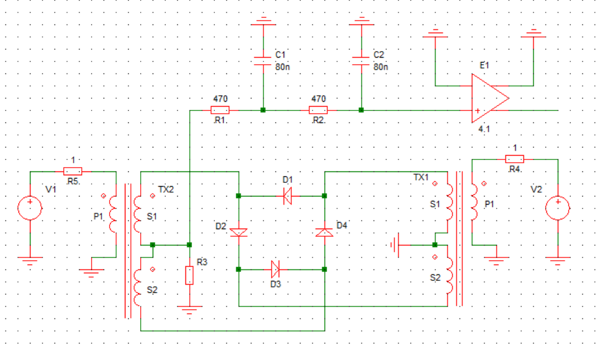

*Figure 29: Demodulator stage in a separate schematic.*

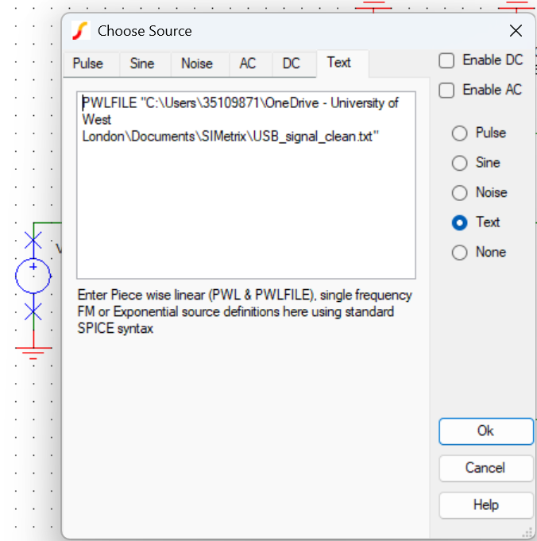

*Figure 30: PWL AC source file.*

### 1.4.6 Coherent Demodulator

The demodulator uses the same centre-tapped transformer DBM topology as the modulator mixers. The USB signal (imported from the PWL file) drives the RF transformer primary, while a locally generated 700 kHz, 10 V, 0° sine wave drives the LO transformer primary. Both sources feed their primaries through a 1 Ω series resistor to prevent the "Singular matrix" error caused by connecting a voltage source directly to a transformer primary (which forms an inductor–voltage source loop in SPICE).

The demodulator multiplies the received USB signal by the local carrier, which produces a difference-frequency component at 1 kHz (701 − 700) carrying the recovered message, alongside a sum-frequency component at 1401 kHz (701 + 700) that the LPF will remove. The IF output is taken from the RF transformer centre tap, with a 1 MΩ resistor to ground for DC biasing.

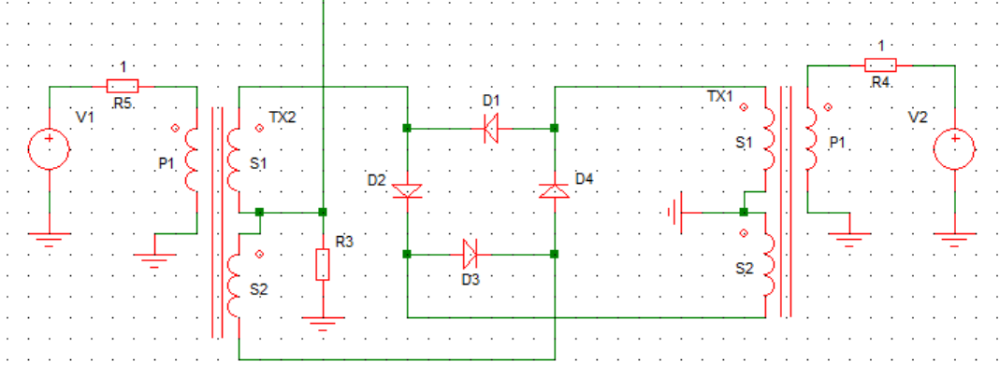

*Figure 31: Demodulator Stage (Separate Schematic).*

### 1.4.7 Low-Pass Filter

The demodulator output is passed through two cascaded first-order RC filter stages, each with R = 470 Ω and C = 80 nF. The cutoff frequency of each stage is:

$$f_c = \frac{1}{2\pi \times 470 \times 80 \times 10^{-9}} = 4.23\ \text{kHz}$$

This passes the recovered 1 kHz message while rejecting the sum-frequency mixing product at 1.401 MHz. The two-stage design provides a −40 dB/decade roll-off, twice as steep as a single stage. While this passes the 1 kHz message and rejects the 1.401 MHz mixing product, the passive filtering and previous stages also reduce the signal amplitude. To compensate, a second VCVS gain stage with a gain of 4.1× was added after the LPF to restore the recovered signal from ~200 mV back to the original 1 V level.

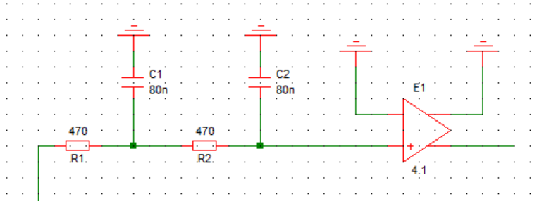

*Figure 32: Low Pass Filter Stage.*

## 1.5 Waveform Analysis and Results

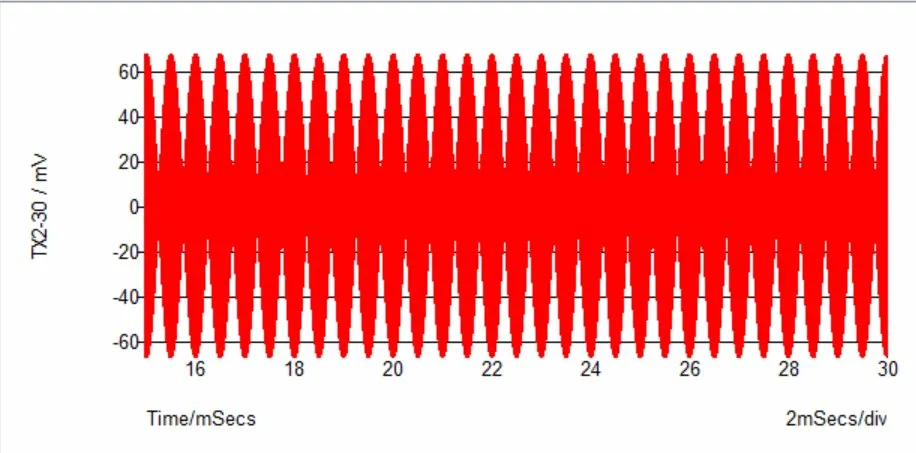

*Figure 33: SIMetrix — Mixer 1 (I path) IF output, time domain.*

The Mixer 1 (I path) IF output shows a DSB-SC waveform with a peak amplitude of approximately 60 mV. The 1 kHz envelope modulation is clearly visible, confirming that the message signal is being mixed with the carrier correctly. The FFT confirms two sidebands of approximately equal amplitude at 699 kHz (LSB) and 701 kHz (USB) with no significant carrier component at 700 kHz, which is consistent with a properly balanced double-balanced mixer.

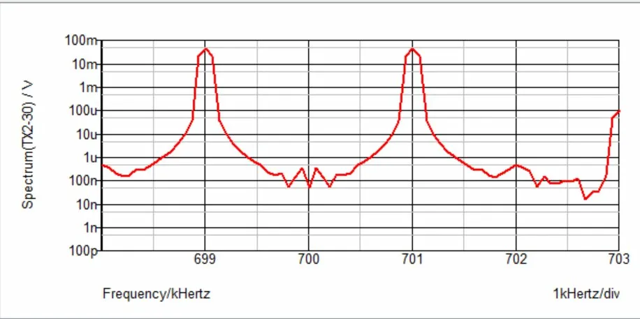

*Figure 34: SIMetrix — Mixer 1 (I path) IF output, FFT zoomed 698–703 kHz.*

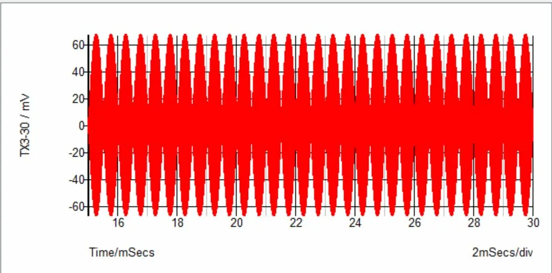

*Figure 35: SIMetrix — Mixer 2 (Q path) IF output, time domain.*

Mixer 2 produces the same DSB-SC structure as the I path, with matching amplitude (~60 mV peak) and identical spectral peaks at 699 kHz and 701 kHz. The similarity in amplitude between both mixers is important, as any significant I/Q amplitude mismatch would reduce the sideband suppression achieved by the difference amplifier.

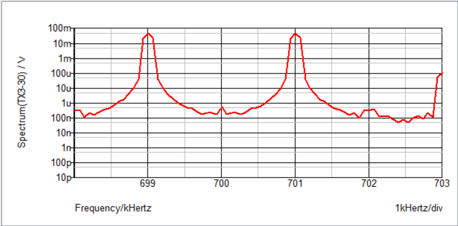

*Figure 36: SIMetrix — Mixer 2 (Q path) IF output, FFT zoomed 698–703 kHz.*

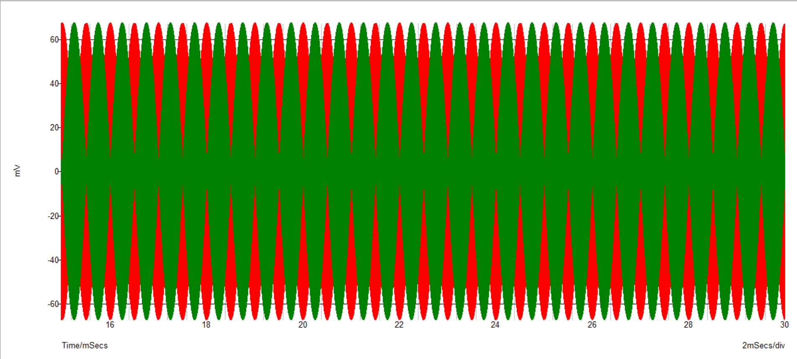

*Figure 37: SIMetrix — Mixer 1 and Mixer 2 IF outputs overlaid, showing 90° phase difference between I and Q paths.*

In the overlay, the I path (red) and Q path (green) run at matching amplitude (~60 mV peak) but with a visible phase envelope offset in their 1 kHz envelope patterns. This phase difference originates from the RC networks providing ±45° shifts to both the carrier and message signals, resulting in a total 90° offset between the two mixer outputs. This quadrature relationship is essential — when the difference amplifier subtracts the I path from the Q path, the lower sideband components at 699 kHz cancel while the upper sideband components at 701 kHz reinforce, producing the desired USB signal.

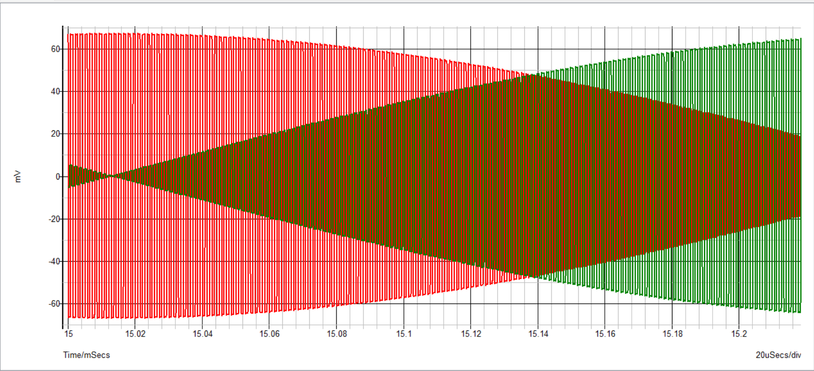

*Figure 38: SIMetrix — Mixer 1 and Mixer 2 IF outputs overlaid, zoomed in.*

Zooming in resolves the individual 700 kHz carrier cycles. A consistent quarter-cycle offset is visible between the red (I) and green (Q) waveforms, confirming the 90° carrier phase shift produced by the RC networks. This is distinct from the envelope-level offset seen in Figure 37 — here the shift is observed cycle-by-cycle at the carrier frequency itself. The presence of quadrature at both the carrier and envelope levels confirms that the phase-shift architecture is working correctly: the ±45° RC splits on both the carrier and message paths combine to produce the full 90° I/Q separation required for sideband cancellation in the difference amplifier.

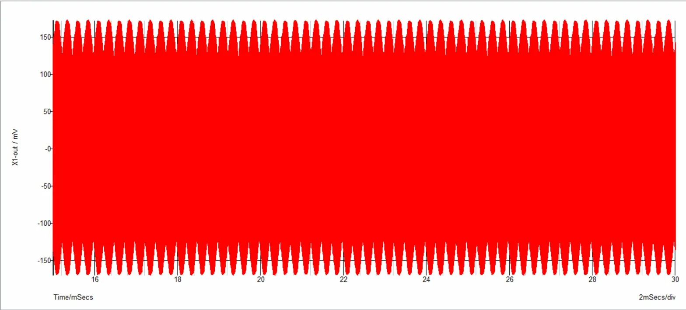

*Figure 39: SIMetrix — LM6172 difference amplifier output, time domain.*

At the difference amplifier output, the signal is a near-constant-envelope sinusoid at approximately 170 mV peak. This is the expected shape of a single-tone USB signal, since only one sideband remains after subtraction. There is no second frequency component to produce the deep amplitude nulls seen in the DSB-SC mixer outputs. The slight envelope ripple is caused by the residual unsuppressed LSB component.

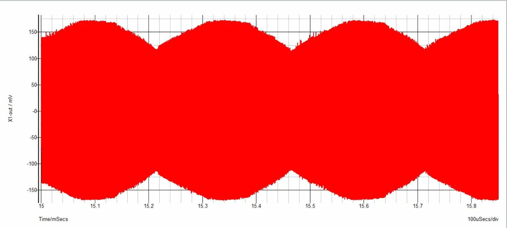

*Figure 40: SIMetrix — LM6172 difference amplifier output, zoomed (100 µs/div).*

A closer look at the envelope reveals a slow beat pattern caused by the small residual LSB at 699 kHz interfering with the dominant USB at 701 kHz. The beat frequency matches the expected 2 kHz difference between the two spectral components. The fact that this ripple is shallow — the envelope varies between approximately 120 mV and 170 mV rather than reaching zero — confirms that the LSB has been heavily suppressed but not perfectly eliminated, which is consistent with the slight I/Q amplitude mismatch inherent in first-order RC phase-shift networks.

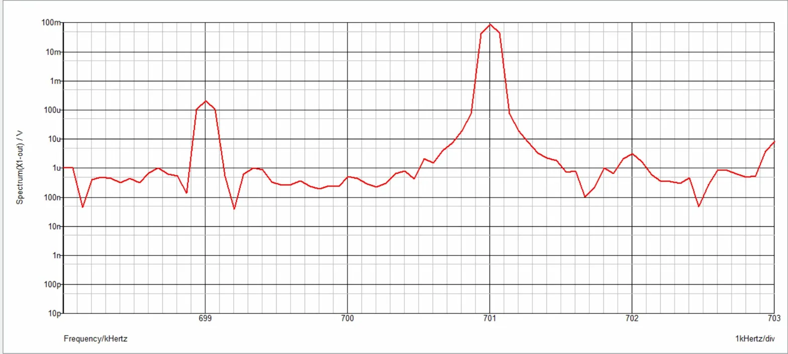

*Figure 41: LM6172 difference amplifier output, FFT (698–703 kHz).*

The FFT confirms successful upper sideband selection. The dominant peak at 701 kHz reaches approximately 80 mV, while the residual LSB at 699 kHz is suppressed to approximately 150 µV, representing a rejection ratio of roughly 54 dB. The carrier at 700 kHz remains absent due to the DBM topology. This level of sideband suppression is a strong result for a first-order RC phase-shift architecture and confirms that the difference amplifier is correctly computing Q − I to cancel the lower sideband.

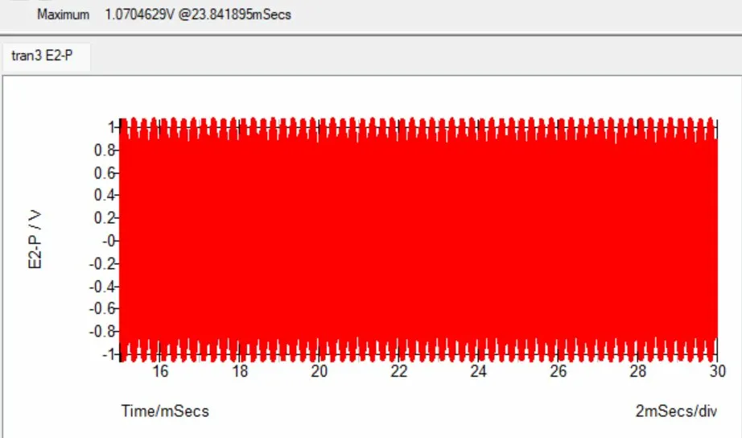

*Figure 42: VCVS gain stage output, time domain (2 ms/div). Cursor measurement: maximum = 1.0705 V.*

The VCVS output shows the same near-constant-envelope USB waveform as the difference amplifier, now scaled up to a peak amplitude of 1.07 V. This confirms that the gain stage is applying the expected gain of 6.25× to the difference amplifier output (~170 mV × 6.25 ≈ 1.06 V), which closely matches the measured value. The 10 nF AC coupling capacitor at the input has successfully blocked any DC offset from propagating through the gain stage.

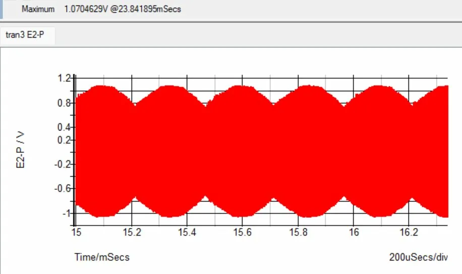

*Figure 43: VCVS gain stage output, zoomed time domain (200 µs/div).*

The same beat pattern observed in Figure 40 appears here, scaled up by the gain factor with the envelope varying between ~0.7 V and 1.07 V. This proves the gain stage amplifies both wanted and residual components equally without introducing additional distortion.

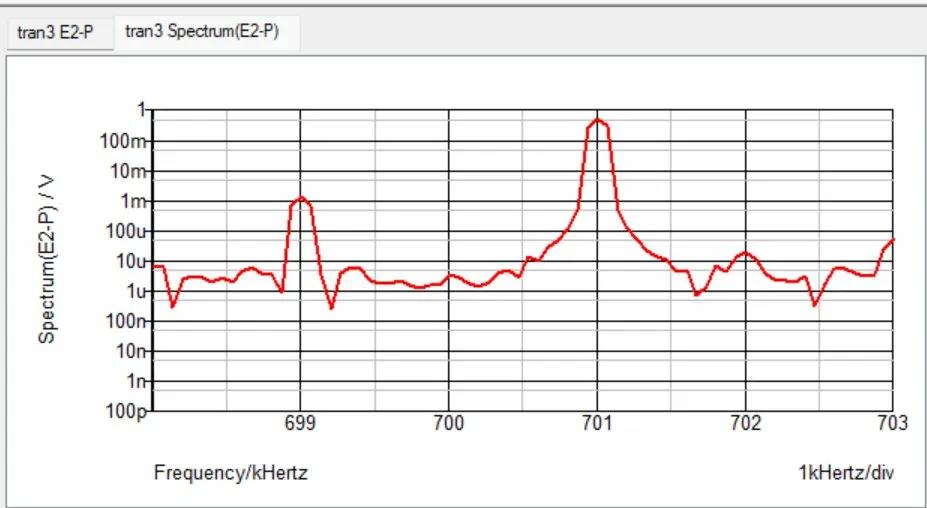

*Figure 44: VCVS gain stage output, FFT (698–703 kHz).*

The FFT confirms the final modulator output spectrum. The USB peak at 701 kHz reaches approximately 400 mV, while the residual LSB at 699 kHz sits at approximately 1 mV, showing a sideband suppression ratio of approximately 52 dB. The carrier at 700 kHz remains absent as before. This spectrum represents the transmitted AM-USB signal: a single dominant sideband at $f_c + f_m = 701$ kHz with strong carrier and lower sideband rejection.

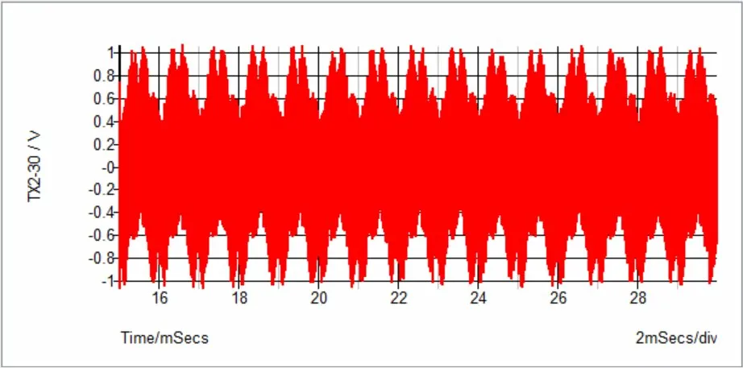

*Figure 45: Demodulator mixer IF output, time domain (2 ms/div).*

The raw demodulator mixer output contains both the desired baseband signal and high-frequency mixing products. The 1 kHz message envelope is visible as the slow amplitude variation, while the dense high-frequency content is the sum-frequency component at approximately 1.4 MHz (701 kHz + 700 kHz LO) generated by the coherent multiplication process. The peak amplitude reaches approximately 1 V.

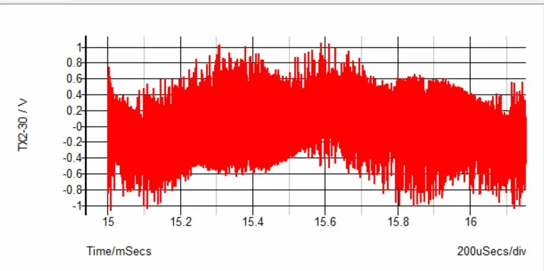

*Figure 46: Demodulator mixer IF output, zoomed time domain (200 µs/div).*

The zoomed view shows the high-frequency mixing products more clearly, with individual carrier-rate oscillations visible throughout the waveform. The underlying 1 kHz baseband variation can still be seen as the slowly changing mean level of the signal. The noisy appearance is expected — the double-balanced mixer produces both the difference frequency (1 kHz, wanted) and the sum frequency (~1.4 MHz, unwanted), and at this timescale both are superimposed.

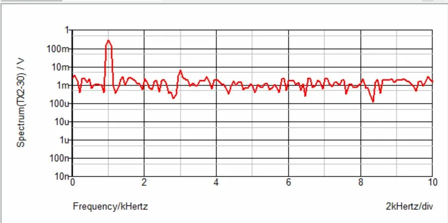

*Figure 47: Demodulator mixer IF output, FFT (0–10 kHz).*

The FFT confirms that the dominant baseband component is at 1 kHz with an amplitude of approximately 200 mV, standing well above the noise floor at roughly 1 mV. This verifies that the coherent demodulator with a 0° phase-matched local oscillator is correctly recovering the original message frequency from the USB signal. The remaining spectral content across 2–10 kHz is residual mixing noise that will be removed by the two-stage RC low-pass filter.

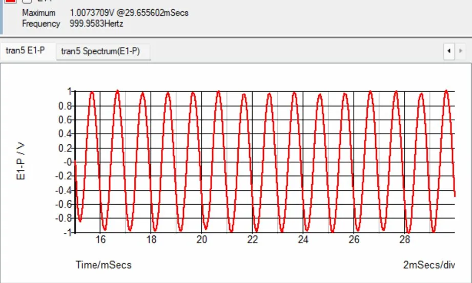

*Figure 48: Demodulated output after LPF and VCVS gain stage, time domain (2 ms/div). Cursor measurements: maximum = 1.007 V, frequency = 999.96 Hz.*

The recovered message signal is a clean 1 kHz sinusoid with a peak amplitude of approximately 1 V, closely matching the original message signal. The cursor-measured frequency of 999.96 Hz confirms accurate frequency recovery with negligible error. A second VCVS gain stage was added after the two-stage RC low-pass filter to restore the signal amplitude from approximately 200 mV back to the original 1 V level. Minor waveform distortion is visible as slight asymmetry between positive and negative half-cycles, which is attributed to the non-ideal diode switching characteristics of the demodulator mixer and residual high-frequency content not fully attenuated by the LPF.

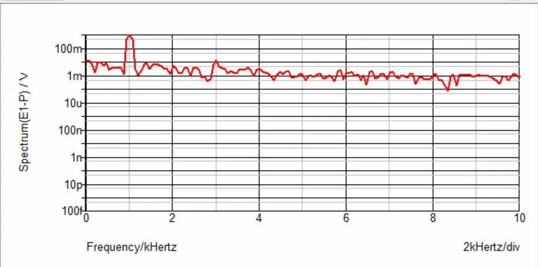

*Figure 49: Demodulated output after LPF and VCVS gain stage, FFT (0–10 kHz).*

The FFT shows a dominant peak at 1 kHz with an amplitude of approximately 200 mV, clearly separated from the noise floor at roughly 1 mV. Compared to the pre-filter FFT (Figure 47), the high-frequency mixing products above the 4.23 kHz LPF cutoff have been attenuated, resulting in a cleaner spectrum. A small harmonic component is visible near 3 kHz, likely a third-harmonic distortion product from the diode-based mixer, but it sits more than 30 dB below the fundamental and does not significantly affect signal quality.

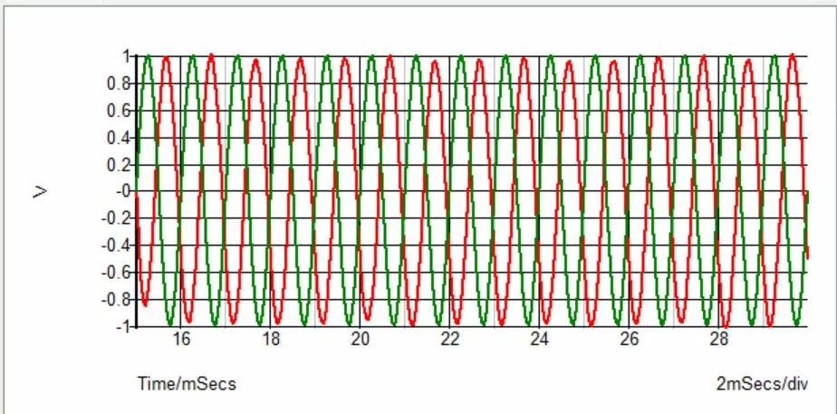

*Figure 50: Original 1 kHz message (green) and demodulated output (red), time domain (2 ms/div).*

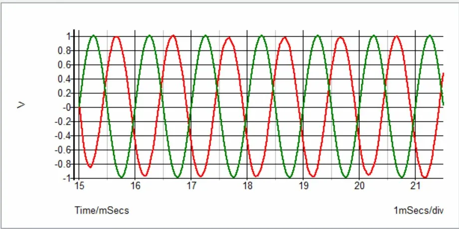

*Figure 51: Original 1 kHz message (green) and demodulated output (red), zoomed time domain (1 ms/div).*

The overlay confirms that the demodulated signal matches the original message in both frequency (1 kHz) and amplitude (~1 V peak), verifying successful USB modulation and coherent demodulation. A phase offset of approximately 90° is visible between the two waveforms. This delay is introduced by the analogue components in the signal chain, primarily the two cascaded RC low-pass filter stages which each contribute approximately 13° of phase lag at 1 kHz, combined with additional phase shifts from the AC coupling capacitors and the modulator's RC phase-shift networks. This phase offset does not represent signal degradation because it is a fixed, frequency-dependent delay inherent to analogue filtering, and would be compensated in a practical receiver using phase-locked synchronisation. The frequency and amplitude match the original message through the full signal chain.

## 1.6 SIMetrix Simulation Analysis

The SIMetrix results confirm the phase-shift architecture, achieving a 52 dB sideband suppression ratio. The LSB is suppressed to 1 mV and the carrier is eliminated by the DBM's symmetric diode bridge, leaving only the upper sideband and halving the transmitted bandwidth to 2 kHz — the spectral efficiency advantage of SSB. Demodulation successfully recovers the 1 kHz message at full amplitude with a predictable 90° phase shift caused by cumulative analogue filtering. While the first-order RC networks provide excellent performance for this single-tone test, their frequency-dependent response remains a primary limitation for wideband applications. This simulation confirms the design is ready for practical implementation.

## 1.7 Phase Angle Experiment

### 1.7.1 Test Method

The analysis focuses on the demodulator's response to phase angle variation between the transmitted carrier and the receiver's local oscillator (LO). For SSB-AM, theory predicts that the recovered signal amplitude is preserved across all LO phase angles, with only the phase of the output changing — distinct from DSB-SC, where the recovered amplitude scales with $\cos(\varphi)$ and falls to zero at $\varphi = 90°$.

The test was performed on the SIMetrix demodulator schematic by varying the LO sine source's phase parameter while leaving the incoming USB signal (PWL-imported from the modulator output) unchanged. This setup reflects a real-world receiver, where the LO is the only parameter under receiver control. Three phase angles were tested as required for comprehensive analysis: $\varphi = 0°,\ 90°,\ 180°$.

### 1.7.2 Results

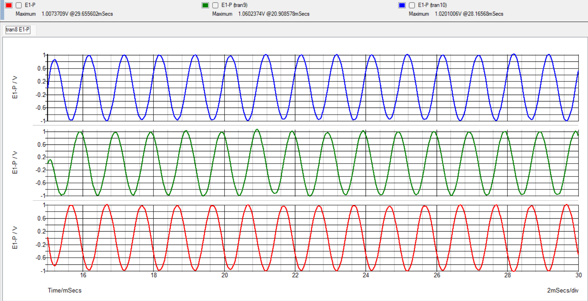

*Figure: Demodulator output for φ = 0° (red, bottom), 90° (green, middle) and 180° (blue, top).*

Cursor measurements gave maximum amplitudes of 1.007 V, 1.060 V and 1.020 V.

**Table 1: Demodulated Output Parameters for Various LO Phase Angles**

| φ (LO phase) | Measured peak (V) | Theoretical recovery               | Phase difference to original |
|--------------|--------------------|-------------------------------------|-------------------------------|
| 0°           | 1.0073709          | ½ m(t)                              | In phase                      |
| 90°          | 1.0602374          | ½ m̂(t) (Hilbert transform)         | 90° shifted                   |
| 180°         | 1.0201006          | −½ m(t)                             | Inverted                      |

### 1.7.3 Analysis

The recovered amplitude remains within ~5% across all three phase points (1.007, 1.060, 1.020 V), confirming the SSB-AM prediction that coherent demodulation preserves amplitude regardless of LO phase. This is the defining behaviour distinguishing SSB-AM from DSB-SC, where amplitude would follow $\cos(\varphi)$ and drop to zero at 90°.

Phase error instead manifests as a phase shift in the output: φ = 0° gives in-phase recovery, φ = 90° gives a 90°-shifted output (the Hilbert transform of the message), and φ = 180° inverts it. The ~5% variation is attributable to sub-cycle peak sampling and slight RC asymmetry between cosine and sine response at 1 kHz, within expected analogue tolerance.

This confirms the implemented system is SSB-AM (Hartley phase-shift method), not DSB-SC, and that the architecture is robust to LO phase error in amplitude — phase-locking is only needed if the recovered signal must be in phase with the original.
