# BPSK with Time Division Multiplexing

> Section A, Part 2 of the TC60056E Communications Systems coursework — University of West London. Mustafa Yaqoobi.

## 2.1 Introduction

This section investigates digital modulation using Binary Phase Shift Keying (BPSK) with Time Division Multiplexing (TDM). Two independent 1 kbps digital signals were multiplexed into a single 2 kbps stream, modulated onto a 700 kHz carrier, and recovered at the receiver using coherent demodulation. The circuit was simulated in SIMetrix using a diode-ring modulator and implemented on a breadboard, with results compared at each stage.

## 2.2 Theory

### 2.2.1 What is BPSK?

Binary Phase Shift Keying (BPSK) is a digital modulation technique that transmits data by flipping the phase of a carrier signal by 180°: a 0° phase represents a binary 1, and a 180° shift represents a binary 0. Because of its simplicity and efficiency, BPSK is a foundational scheme used in Wi-Fi, Bluetooth, and satellite systems.

A carrier signal is a pure sine wave:

$$s(t) = A_c \cos(2\pi f_c t)$$

BPSK multiplies this by either +1 (for bit 1) or −1 (for bit 0):

For binary 1: $s(t) = +A_c \cos(2\pi f_c t)$ (carrier unchanged, 0° phase)

For binary 0: $s(t) = -A_c \cos(2\pi f_c t)$ (carrier flipped, 180° phase shift)

Both formulas are equivalent since $\cos(\theta + \pi) = -\cos(\theta)$, so both cases can therefore be written as one single equation:

$$s(t) = m(t) \times A_c \cos(2\pi f_c t)$$

where m(t) is a bipolar signal taking values +1 (bit 1) or −1 (bit 0). The sign flip is the physical 180° phase shift that defines BPSK.

### 2.2.2 Time Division Multiplexing (TDM)

Multiplexing allows multiple data streams to share a single physical channel. In Time Division Multiplexing (TDM), signals take turns by occupying specific time slots. In this system, two independent 1 kbps signals are combined by alternating their bits, resulting in a single 2 kbps stream where a new bit is transmitted every 0.5 ms.

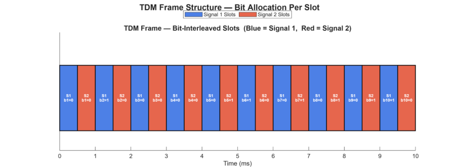

*Figure: TDM time slot allocation diagram.*

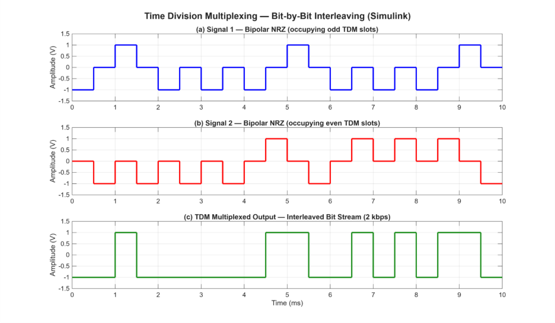

*Figure: Bit-by-bit interleaving — 3-subplot figure showing combined output.*

The interleaving process shown above is broken down as follows:

- **Plot (a) Signal 1 (Blue):** occupies the odd time slots (1, 3, 5, ...), with gaps reserved for Signal 2.
- **Plot (b) Signal 2 (Red):** occupies the even time slots (2, 4, 6, ...), filling the gaps left by Signal 1.
- **Plot (c) TDM Output (Green):** the final interleaved stream. Each bit is half the original width because the two streams now share the same time window, doubling the combined rate to 2 kbps.

### 2.2.3 BPSK Modulation Process

BPSK modulation maps binary symbols directly to the phase of the carrier. A binary 1 is transmitted with no phase change (0°), while a binary 0 is transmitted with a 180° phase shift. In signal space, the constellation diagram consists of two points located solely on the in-phase (I) axis. Since BPSK only uses one basis function, there is no quadrature (Q) component, and all information is contained within the phase reversals of the carrier.

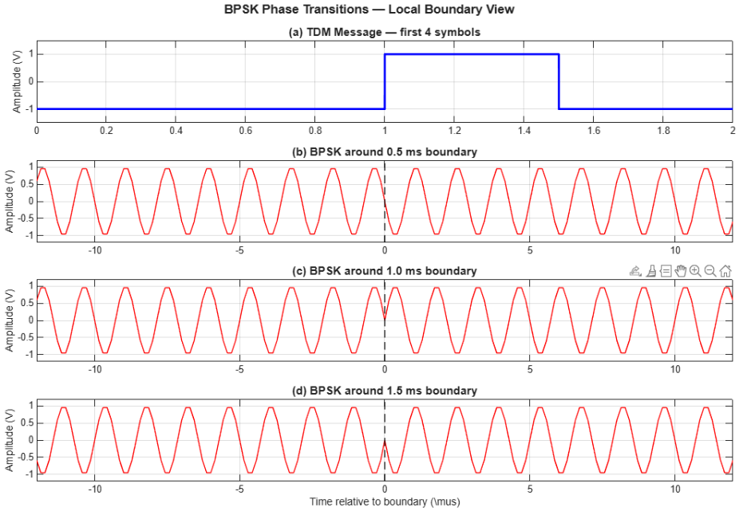

*Figure: BPSK phase transition behaviour at TDM bit boundaries (theoretical waveforms).*

The phase transitions in the waveform are visible at the bit boundaries:

- **0.5 ms boundary:** no phase change because the bit state is unchanged.
- **1.0 ms and 1.5 ms boundaries:** a sharp 180° phase reversal as the carrier flips polarity, marking the transition between a binary 0 (−1 V) and a binary 1 (+1 V).

### 2.2.4 BPSK Demodulation Process (Coherent Detection)

Coherent demodulation requires the receiver to know the carrier's frequency and phase. The incoming BPSK signal is multiplied by a locally generated carrier identical to the one used in the transmitter.

The received signal r(t) is expressed as:

$$s(t) \times \cos(2\pi f_c t) = m(t) \cos^2(2\pi f_c t)$$

Applying the trigonometric identity $\cos^2(\theta) = \tfrac{1}{2}(1 + \cos(2\theta))$:

$$= \frac{m(t)}{2} + \frac{m(t)}{2} \cos(4\pi f_c t)$$

The double-frequency term $\cos(4\pi f_c t)$ is at 1.4 MHz, far above the signal bandwidth, and is removed in the next stage by a low-pass filter, leaving only the baseband bipolar NRZ signal proportional to the original m(t).

A comparator (hard-decision stage) then thresholds the filtered signal against 0 V: outputs above 0 V are decoded as a binary 1, outputs below 0 V as a binary 0. The recovered TDM bit stream is then demultiplexed by routing odd-indexed bits to Signal 1 and even-indexed bits to Signal 2, reconstructing both original signals.

## 2.3 SIMetrix Simulation

The BPSK with TDM circuit was implemented in SIMetrix to confirm that the modulation and demodulation behaviour could be reproduced using an analogue circuit. This ensured that the 180° phase reversals, TDM bit timing, and coherent detection would all operate correctly when driven by a practical ±1 V bipolar NRZ signal rather than an ideal mathematical input.

The TDM bitstream was generated using a piecewise linear (PWL) voltage source with 0.5 ms bit slots, driving the SIMetrix circuit to produce carrier inversions at each bit transition.

### 2.3.1 PWL TDM bit parameters

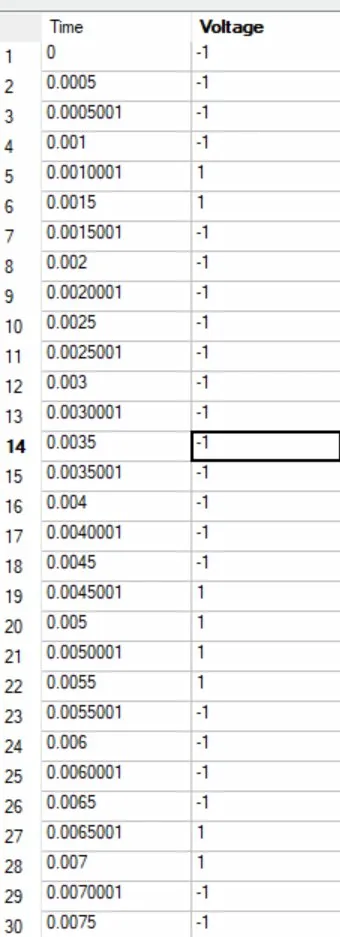

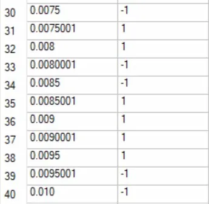

*Figure: PWL source settings.*

The PWL voltage source generates a ±1 V bipolar NRZ signal with 0.5 ms bit slots. Each bit transition uses a 0.1 µs rise/fall time to ensure SPICE convergence; this is fast enough to appear instantaneous on the millisecond timescale of the message.

The interleaved 20-bit sequence `[0 0 1 0 0 0 0 0 0 1 1 0 0 1 0 1 0 1 1 0]` encodes both signals at a rate of 2 kbps:

- **Signal 1 (odd slots):** `[0 1 0 0 0 1 0 0 0 1]`
- **Signal 2 (even slots):** `[0 0 0 0 1 0 1 1 1 0]`

### 2.3.2 Modulation stage

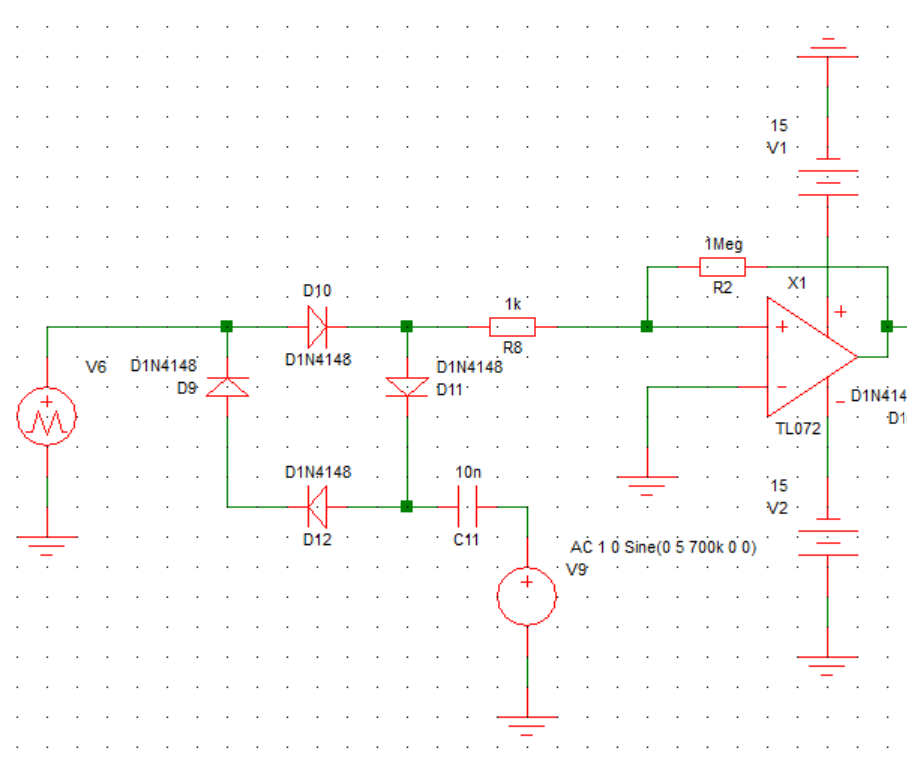

*Figure: Practical circuit — Modulation Stage.*

The modulation stage spans the PWL message source through to the output of the first op-amp. The PWL bitstream drives a diode-ring modulator built from four 1N4148 diodes, which hard-switches the 700 kHz carrier (5 V peak) based on the bipolar message polarity to produce the BPSK-modulated signal. A TL072 op-amp at the output buffers and amplifies the modulator output.

### 2.3.3 Demodulation stage and Low-Pass Filter

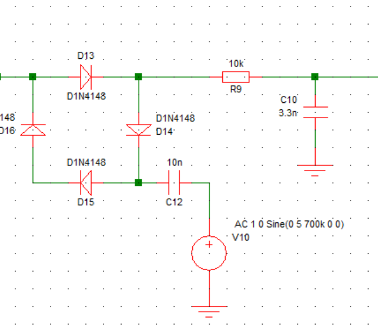

*Figure: Practical circuit — Demodulation Stage.*

The demodulation stage begins at the output of the first op-amp and ends at the low-pass filter output. A second diode-ring (four 1N4148 diodes) hard-switches the modulated BPSK signal with a locally generated 700 kHz, 5 V sine wave (LO), recovering the bipolar baseband data. The recovered baseband is passed through a first-order RC low-pass filter (R = 10 kΩ, C = 3.3 nF) with a cutoff frequency of:

$$f_c = \frac{1}{2\pi \times 10000 \times 3.3 \times 10^{-9}} = 4.82\ \text{kHz}$$

This rejects the 1.4 MHz double-frequency mixing product (700 kHz + 700 kHz) while passing the 2 kbps NRZ baseband content well within its passband.

### 2.3.4 Amplification and comparator stage

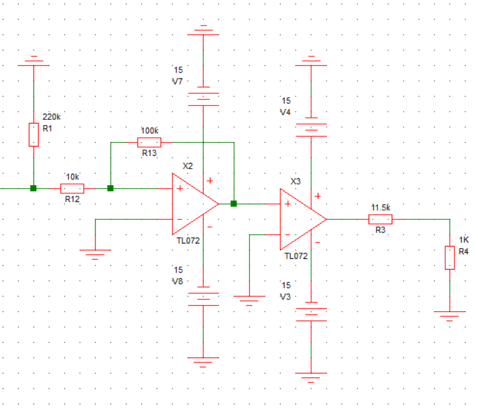

*Figure: Practical circuit — Amplifier/Comparator Stage.*

This stage begins at the output of the low-pass filter through to the final output of X3. The recovered baseband signal is amplified by an inverting amplifier (X2, TL072) with a gain of 10 (Rf = 100 kΩ, Rin = 10 kΩ), boosting the LPF output back to a high amplitude. A 220 kΩ resistor at the input provides DC bias.

The amplified signal then drives a TL072 (X3) configured as an open-loop comparator. With no feedback resistor, the op-amp swings to its supply rails (~±13 V) at every zero-crossing of the input, producing a clean digital output. The R3–R4 voltage divider (11.5 kΩ / 1 kΩ) scales this rail-to-rail swing back to approximately ±1 V, matching the amplitude of the original PWL bitstream and enabling direct overlay comparison.

## 2.4 Waveform Results

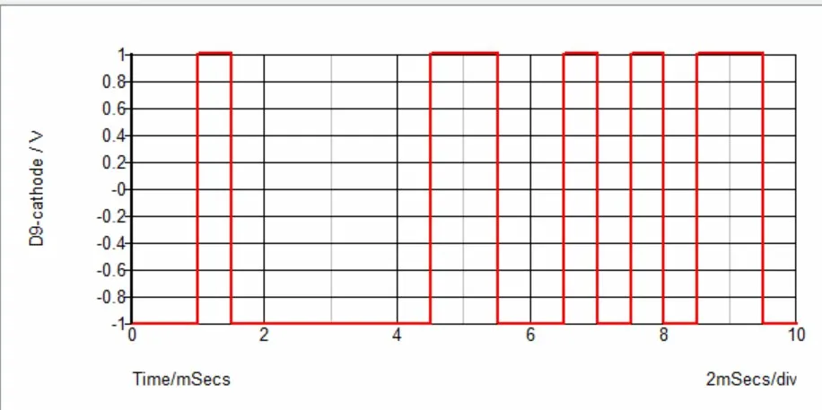

*Figure: BPSK SIMetrix — PWL Input Bitstream, Time Domain (2 ms/div).*

The first probe was placed at the output of the PWL voltage source to verify the input data. The measured waveform shows a ±1 V bipolar NRZ signal with 0.5 ms wide bit slots (2 kbps), confirming that the circuit is driven by the expected TDM sequence.

*Figure: SIMetrix — Carrier Signal.*

The 700 kHz carrier appears as a dense red block at the 2 ms/div timescale, confirming continuous oscillation with constant amplitude across the full simulation window. The 5 V peak amplitude matches the SIMetrix source setting and provides sufficient drive to fully switch the 1N4148 diode rings.

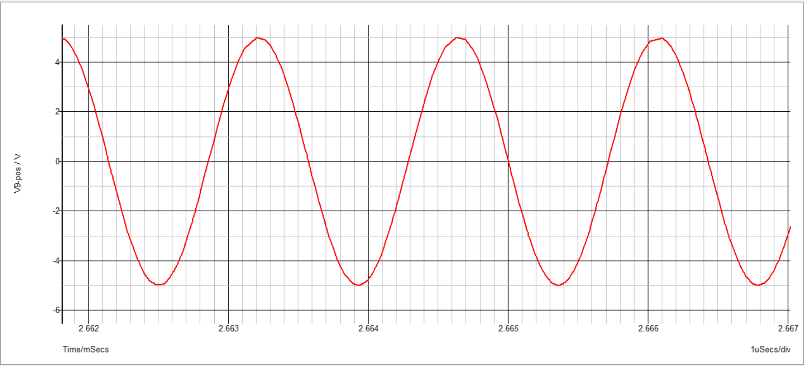

*Figure: SIMetrix — Carrier Signal Zoomed.*

The carrier waveform is resolved at 1 µs/div as a clean 700 kHz sinusoid with constant amplitude and a period of approximately 1.43 µs (1/700 kHz), confirming the local oscillator is operating at the correct frequency and provides a stable reference for both the modulator and the coherent demodulator.

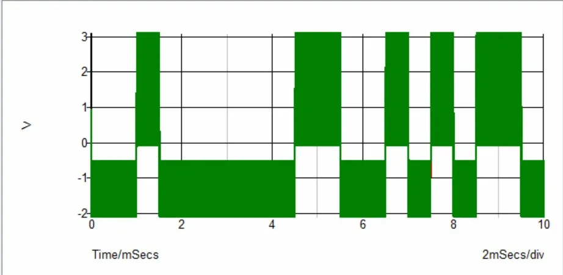

*Figure: BPSK modulated signal — first diode ring output (after load resistor), time domain (2 ms/div).*

The amplitude swings between approximately +3 V and −2 V, reduced from the 5 V carrier drive due to diode forward voltage drops in the 1N4148 ring. The slight asymmetry between positive and negative peaks reflects unmatched conduction paths in the diode ring, but the phase-reversal timing matches the PWL input exactly proving correct BPSK modulation.

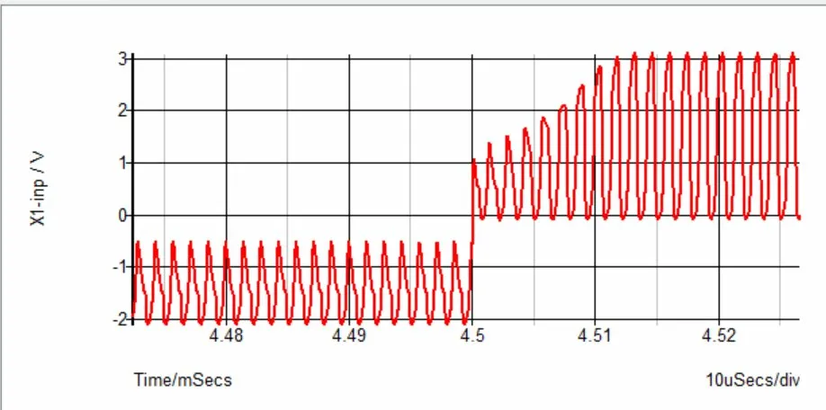

*Figure: BPSK modulated signal — zoomed at bit transition (10 µs/div).*

The zoomed view captures the 180° phase reversal at the 4.5 ms bit boundary, where the TDM sequence transitions from bit 0 (−1 V) to bit 1 (+1 V). The carrier settles to full amplitude within a few cycles after the transition, with brief ringing at the transition, which is a characteristic of a practical diode ring modulator.

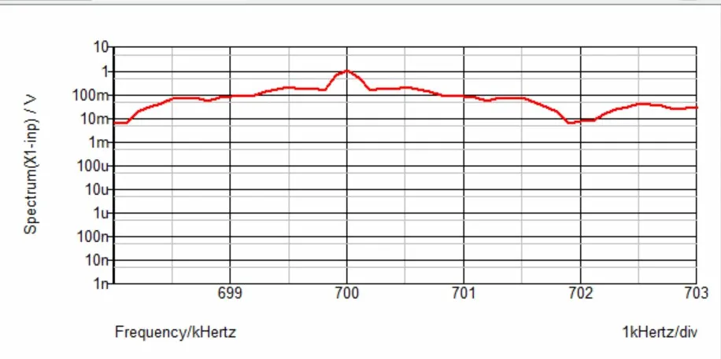

*Figure: SIMetrix — BPSK Modulated Signal, FFT (698–703 kHz).*

The FFT shows the characteristic BPSK spectral shape: a broadened main lobe centred at 700 kHz with a peak of approximately 1 V, rather than a discrete carrier spike. The spectral spreading corresponds to the 2 kbps data rate, with visible nulls at approximately 698 kHz and 702 kHz consistent with the theoretical first-null bandwidth of 2 × 2 kbps = 4 kHz.

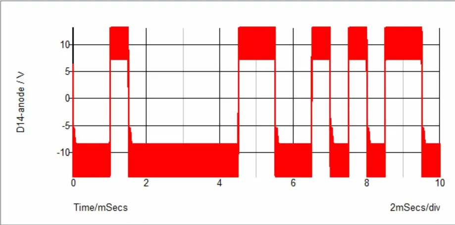

*Figure: BPSK SIMetrix — product detector output (before LPF), time domain (2 ms/div).*

The raw product detector output from the second diode ring shows the baseband NRZ pattern swinging between approximately ±13 V (the X1 modulator op-amp's saturated rail-to-rail output passed through the diode ring), with the 1.4 MHz sum-frequency mixing product superimposed as dense high-frequency oscillations. The polarity of the underlying envelope follows the original TDM bitstream, confirming that the coherent detection is recovering the correct data prior to filtering.

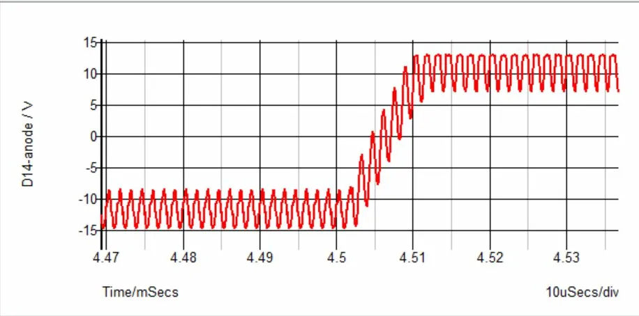

*Figure: Product detector output — zoomed at bit transition (10 µs/div).*

The zoomed view shows the individual 700 kHz carrier-rate cycles in the raw product detector output, swinging rail-to-rail at ±13 V, with the polarity transition clearly visible at the 4.5 ms bit boundary. The product detector output is then passed through the RC low-pass filter (R9 = 10 kΩ, C10 = 3.3 nF, fc ≈ 4.8 kHz) to remove the 1.4 MHz sum-frequency component, isolating the baseband NRZ signal which is then amplified by X2.

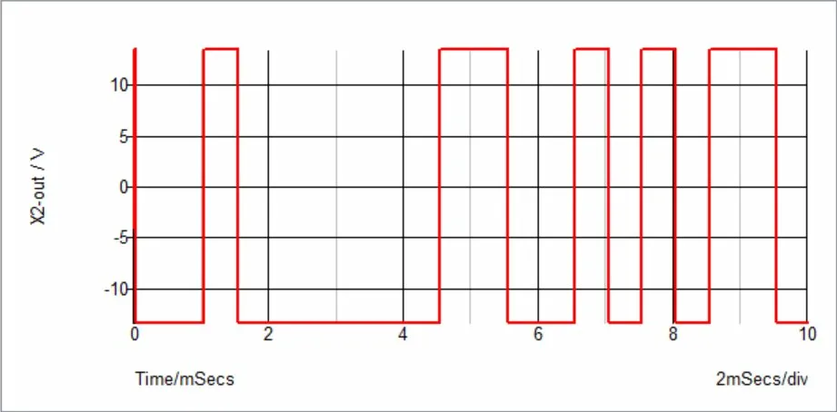

*Figure: BPSK SIMetrix — X2 amplifier output, time domain (2 ms/div).*

The X2 amplifier output shows a ±13 V square wave with sharp transitions, saturated at the ±15 V supply rails. Although X2 is configured with a gain of 10 (Rf/Rin = 100 kΩ / 10 kΩ), the input from the LPF is already large enough (~±13 V from the saturated X1 modulator stage) to drive X2 immediately into saturation, so it functions here as a hard limiter rather than a linear amplifier. All bit boundaries align with the original TDM timing, confirming that the recovered polarity is correct prior to the final comparator stage. The X2 output is then passed through the X3 open-loop comparator, which slices the signal at the zero threshold and outputs a clean rail-to-rail digital signal at the supply rails. The R3/R4 divider (11.5 kΩ / 1 kΩ) scales this swing down to approximately ±1 V at the final output, matching the amplitude of the original PWL bitstream.

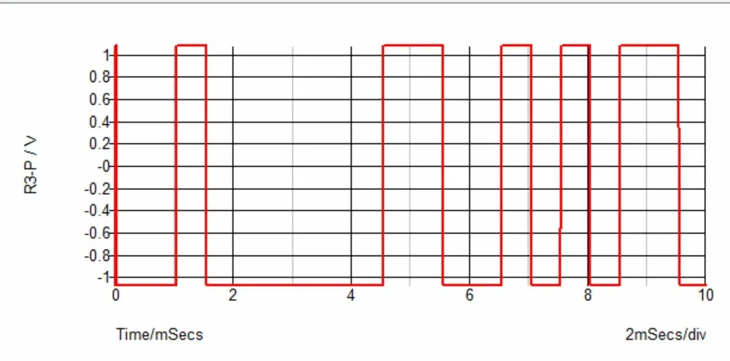

*Figure: Voltage Divider Output — recovered baseband (2 ms/div).*

The R3/R4 divider scales the comparator's ±13 V output down to approximately ±1 V, matching the amplitude of the original PWL bitstream. The recovered baseband shows clean digital edges with sharp transitions at every TDM bit boundary, confirming that the full BPSK chain — modulator, product detector, LPF, X2 amplifier, and X3 comparator — has correctly recovered the original ±1 V signal. The slightly rounded edges visible at each transition are the residual effect of the RC filter's 33 µs time constant, which settles well within each 0.5 ms bit slot and does not affect BPSK demodulation since the information is carried in carrier phase, not amplitude.

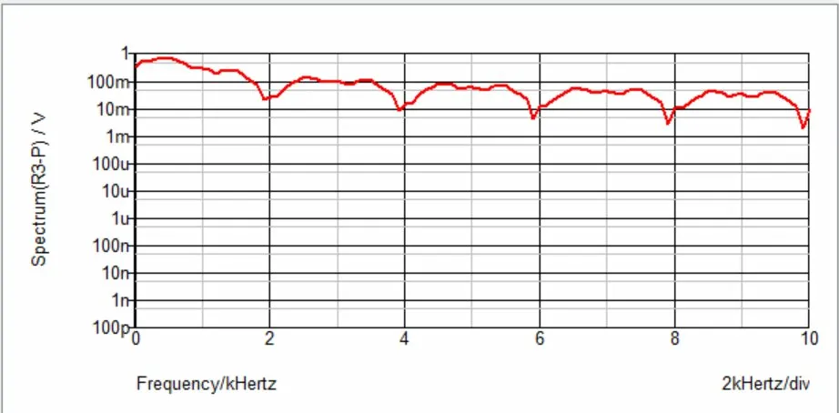

*Figure: BPSK SIMetrix — Voltage Divider Output FFT (0–10 kHz).*

The FFT of the recovered baseband signal shows energy concentrated below 2 kHz, consistent with the 2 kbps NRZ data rate. The spectral envelope follows the expected sinc shape, with nulls visible at approximately 2 kHz and 4 kHz, and shallower dips at 6 kHz and 8 kHz, corresponding to multiples of the TDM bit rate. No spectral energy is present at or near 700 kHz, confirming that the carrier and all high-frequency mixing products have been fully removed by the RC low-pass filter.

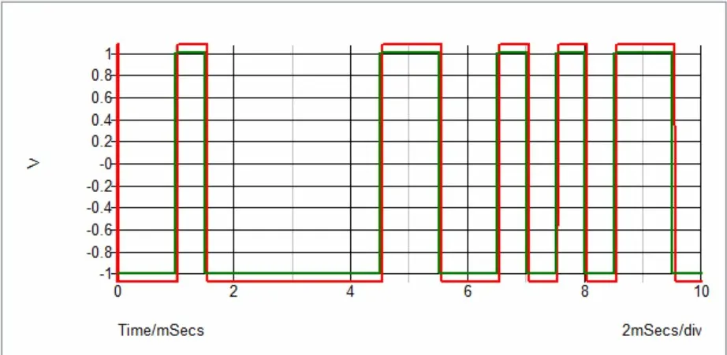

*Figure: BPSK SIMetrix — Original TDM input (green) vs recovered output (red) overlay.*

The overlay confirms bit-by-bit agreement between the original PWL input and the final recovered output across all 20 TDM slots. The only visible difference is a minor edge offset on the recovered signal due to combined LPF group delay and comparator response time, a normal artifact of any analogue signal chain that does not affect BER. The frequency, amplitude, and polarity of every bit are preserved through the complete modulation–transmission–demodulation chain, proving zero-bit errors across all 20 slots.

## 2.5 SIMetrix Simulation Analysis

The SIMetrix waveforms verify the BPSK with TDM design end-to-end. The full chain — modulator (X1 saturated hard limiter), product detector, LPF, X2 amplifier, X3 comparator, and R3/R4 divider — recovers the original PWL bitstream with a Bit Error Rate of 0/20. The BPSK modulation index of π radians (180°) provides maximum constellation separation between the two symbol points, giving optimal detection margin against the non-ideal effects introduced by the practical circuit (diode switching distortion, op-amp saturation, and RC filter phase lag). Because BPSK encodes information in carrier phase rather than amplitude, hard-limiting through the saturated X1 stage does not degrade the result — the only visible artifact is a small edge offset between the original and recovered signals, attributable to LPF group delay and comparator response time, which has no effect on bit-by-bit decoding.

Unlike SSB-AM (Section 1.6), BPSK coherent demodulation is highly sensitive to local oscillator phase error. The recovered signal amplitude scales with $\cos(\varphi)$: at φ = 0° the full signal is recovered, at φ = 90° the recovered amplitude collapses to zero, and at φ = 180° the signal is recovered inverted. This is the opposite behaviour to SSB-AM, where amplitude is preserved across all phase angles and only the output phase changes. The implication for BPSK receivers is that LO phase synchronisation is essential — even a small phase drift directly degrades the bit-decision margin at the comparator. In this implementation, the same 700 kHz oscillator drives both the modulator and demodulator (split via a BNC T-splitter on the breadboard, or a shared sine source in SIMetrix), guaranteeing zero phase error and therefore optimal recovery, which the BER = 0/20 result confirms.

**Table: Bit-by-bit comparison of original TDM input and SIMetrix recovered output.**

| TDM Slot | Time (ms)   | Input (PWL) | Output (Recovered) | Match? |
|----------|-------------|-------------|---------------------|--------|
| 1        | 0–0.5       | −1 (0)      | −1 (0)              | ✓      |
| 2        | 0.5–1.0     | −1 (0)      | −1 (0)              | ✓      |
| 3        | 1.0–1.5     | +1 (1)      | +1 (1)              | ✓      |
| 4        | 1.5–2.0     | −1 (0)      | −1 (0)              | ✓      |
| 5        | 2.0–2.5     | −1 (0)      | −1 (0)              | ✓      |
| 6        | 2.5–3.0     | −1 (0)      | −1 (0)              | ✓      |
| 7        | 3.0–3.5     | −1 (0)      | −1 (0)              | ✓      |
| 8        | 3.5–4.0     | −1 (0)      | −1 (0)              | ✓      |
| 9        | 4.0–4.5     | −1 (0)      | −1 (0)              | ✓      |
| 10       | 4.5–5.0     | +1 (1)      | +1 (1)              | ✓      |
| 11       | 5.0–5.5     | +1 (1)      | +1 (1)              | ✓      |
| 12       | 5.5–6.0     | −1 (0)      | −1 (0)              | ✓      |
| 13       | 6.0–6.5     | −1 (0)      | −1 (0)              | ✓      |
| 14       | 6.5–7.0     | +1 (1)      | +1 (1)              | ✓      |
| 15       | 7.0–7.5     | −1 (0)      | −1 (0)              | ✓      |
| 16       | 7.5–8.0     | +1 (1)      | +1 (1)              | ✓      |
| 17       | 8.0–8.5     | −1 (0)      | −1 (0)              | ✓      |
| 18       | 8.5–9.0     | +1 (1)      | +1 (1)              | ✓      |
| 19       | 9.0–9.5     | +1 (1)      | +1 (1)              | ✓      |
| 20       | 9.5–10.0    | −1 (0)      | −1 (0)              | ✓      |

The table was generated by reading the polarity of each 0.5 ms TDM slot from the overlay. All 20 slots match in polarity, yielding **BER = 0/20 = 0.0000**.

## 2.6 Breadboard implementation

Having verified the BPSK/TDM system in SIMetrix, the circuit was built on a breadboard to confirm that the same modulation and demodulation behavior could be achieved using physical components. This hardware implementation follows the SIMetrix topology which uses a diode-ring modulator, TL072 gain stage, diode-ring demodulator, RC low-pass filter, and TL072 comparator, with two minor adaptations. The gain stage was configured as a Schmitt trigger for robust bit detection, and the output voltage divider was omitted as amplitude scaling was unnecessary for polarity comparison. These changes are deliberate engineering choices to optimize the physical circuit for bit-level accuracy across all 20 slots.

### 2.6.1 Test Setup

The TDM bitstream was programmed manually into the AFG1022 using the arbitrary waveform editor. The 20-bit sequence `[0 0 1 0 0 0 0 0 0 1 1 0 0 1 0 1 0 1 1 0]` was entered as a custom waveform with each bit held for 0.5 ms, giving a total period of 10 ms and a bit rate of 2 kbps. The waveform swings between −1 V and +1 V with no DC offset, matching the SIMetrix PWL source exactly.

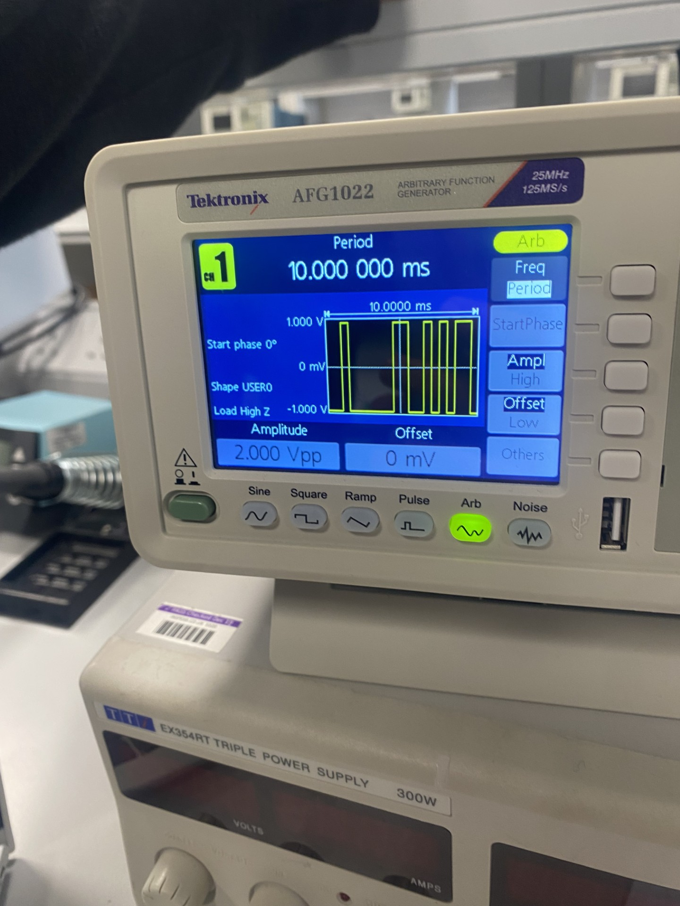

*Figure: Tektronix arbitrary waveform generator displaying programmed TDM bitstream.*

The carrier signal was generated on the second channel of the same AFG1022, set to a 700 kHz sine wave at 10 Vpp (±5 V peak). This amplitude is necessary to ensure all four 1N4148 diodes in each ring are fully forward-biased during each half-cycle of the carrier. A BNC T-splitter was used to feed the same carrier signal to both diode rings, guaranteeing 0° phase match between the modulator carrier and the demodulator local oscillator — a requirement for coherent detection.

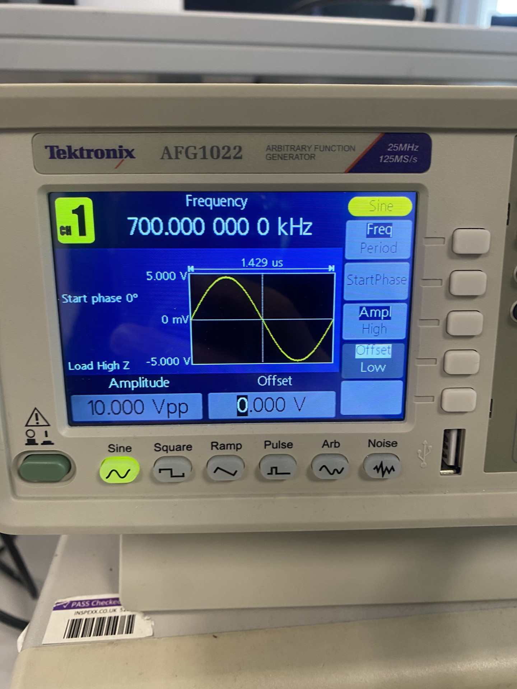

*Figure: BPSK breadboard — Tektronix AFG1022 carrier configuration (700 kHz, 10 Vpp, 0° phase).*

The AFG1022 second channel was configured to output a 700 kHz, 10 Vpp sine wave with 0° start phase and no DC offset, matching the SIMetrix carrier source. The same signal feeds both the modulator and demodulator diode rings via a BNC T-splitter, ensuring identical frequency and phase between the transmitter carrier and the receiver's local oscillator.

### 2.6.2 Circuit Description

The breadboard circuit was built on a single full-size 830-point breadboard. The signal flows left to right across the board, following the same stage order as the SIMetrix schematic:

**Modulator:** The TDM message signal enters the first 1N4148 diode ring, where it is multiplied by the 700 kHz carrier to produce the BPSK-modulated signal. The diode ring was wired in a clockwise cathode-to-anode configuration, with four nodes on four separate breadboard rows to avoid short circuits. R8 (1 kΩ) acts as the load resistor on the signal output node. C11 (10 nF) provides AC coupling on the carrier input side.

**Gain stage:** The modulated signal passes through R8 into TL072 #1 pin 3 (non-inverting input), with pin 2 connected to ground. R2 (1 MΩ) provides positive feedback from pin 1 to pin 3, causing the op-amp to operate as a zero-crossing comparator with hysteresis. The output at pin 1 swings to approximately ±13.4 V (supply rail saturation), effectively hard-limiting the BPSK signal. This does not affect the data — BPSK encodes information in carrier phase, not amplitude.

**Demodulator:** The amplified BPSK signal from pin 1 feeds the second 1N4148 diode ring, which performs coherent detection by multiplying the received signal with the 700 kHz local oscillator (same carrier via BNC T-splitter). The output contains the desired baseband NRZ component plus a sum-frequency mixing product at approximately 1.4 MHz.

**Low-pass filter:** R9 (10 kΩ) and C10 (3.3 nF) form a single-pole RC filter with a cutoff frequency of approximately 4.8 kHz. This removes the 1.4 MHz mixing product and passes the baseband data. A 220 kΩ resistor to ground provides a DC bias path.

**Comparator:** The filtered signal passes through R12 (10 kΩ) into TL072 #2 pin 3 (non-inverting input), with pin 2 grounded. The output at pin 1 produces a clean ±13.4 V square wave corresponding to the recovered NRZ data.

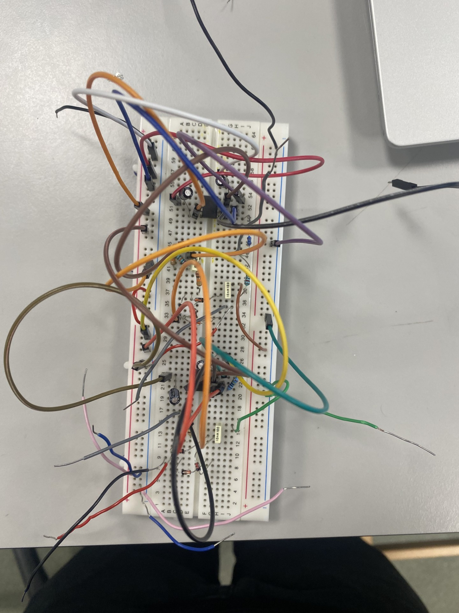

*Figure: Completed BPSK breadboard circuit.*

### 2.6.3 Breadboard Components

**Table: BPSK breadboard component list.**

| Component             | Value / Part           | Qty | Function                                                |
|-----------------------|------------------------|-----|---------------------------------------------------------|
| Diode                 | 1N4148                 | 8   | Two diode rings (4 per ring) — modulator and demodulator|
| Op-amp IC             | TL072CP                | 2   | #1: gain stage / comparator, #2: output comparator      |
| Resistor              | 1 kΩ                   | 1   | R8: first diode ring load resistor                      |
| Resistor              | 1 MΩ                   | 1   | R2: positive feedback path on first TL072 (gain stage)  |
| Resistor              | 10 kΩ                  | 2   | R9: demodulator load, R12: comparator input             |
| Resistor              | 220 kΩ                 | 1   | DC bias path to ground at LPF output                    |
| Capacitor             | 10 nF                  | 2   | C11, C12: carrier coupling on both diode rings          |
| Capacitor             | 3.3 nF                 | 1   | C10: RC low-pass filter (with R9)                       |
| Capacitor             | 100 nF (0.1 µF)        | 4   | Bypass / decoupling on both TL072 supply pins           |
| Power supply          | ±15 V DC               | 1   | Dual-supply for both op-amps                            |
| Function generator    | 700 kHz, 10 Vpp sine   | 1   | Carrier + LO via BNC T-splitter                         |
| Arb. function gen.    | ±1 V NRZ, 10 ms period | 1   | TDM message input (20-bit custom waveform)              |
| Breadboard            | 830 tie-points         | 1   | Full circuit on single board                            |

> **Note:** The SIMetrix R3/R4 output divider was not implemented on the breadboard, as bit-level polarity comparison can be made directly from the ±13.4 V comparator output without amplitude scaling.

## 2.7 Breadboard Waveform Results

### 2.7.1 Input Signal (TDM Bitstream)

The oscilloscope was connected to the first diode-ring message input node to verify that the AFG output was reaching the circuit correctly. The measured waveform shows the ±1 V bipolar NRZ signal with 0.5 ms bit slots, matching the programmed TDM sequence. The on-screen frequency reading of approximately 507 Hz reflects the scope's auto-counter measuring the dominant symbol-transition cadence in this specific 20-bit pattern, not the underlying 2 kbps bit rate.

The pulse pattern — a single pulse near the start, a long gap, then a cluster of pulses — matches the expected interleaved sequence `[0 0 1 0 0 0 0 0 0 1 1 0 0 1 0 1 0 1 1 0]`. Slight rounding on the edges compared to the AFG screen is normal and comes from breadboard parasitic capacitance and probe loading.

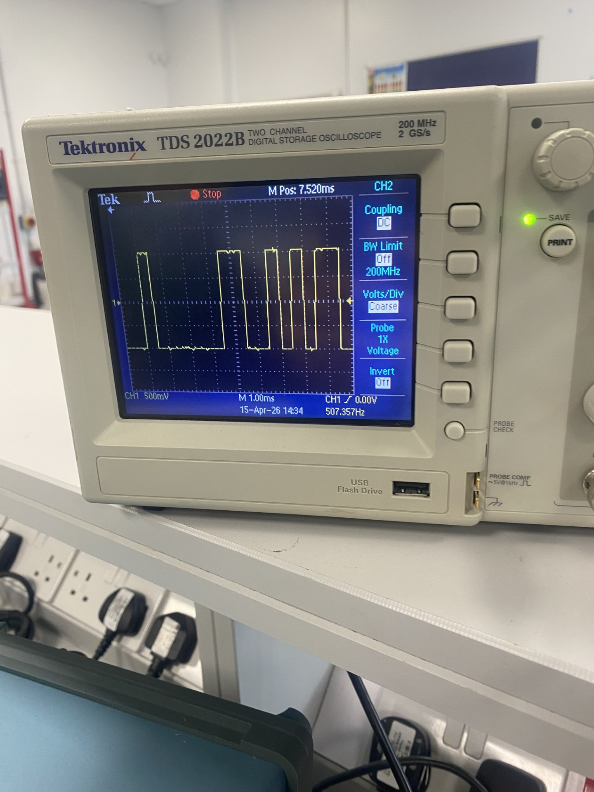

*Figure: Input TDM bitstream probed at first diode ring message node (±1 V, 0.5 ms/bit).*

### 2.7.2 BPSK Modulated Signal

The BPSK modulated signal was probed at the output of the first diode ring. At the wide timescale, the 700 kHz carrier appears as a solid band that switches polarity at each bit boundary. The gaps between the square waveforms are the 180° phase reversals where the carrier passes through zero as it flips. The carrier amplitude is approximately ±4 V, consistent with the 5 V peak drive minus the ~1 V total forward voltage drop across the two conducting diodes in the ring.

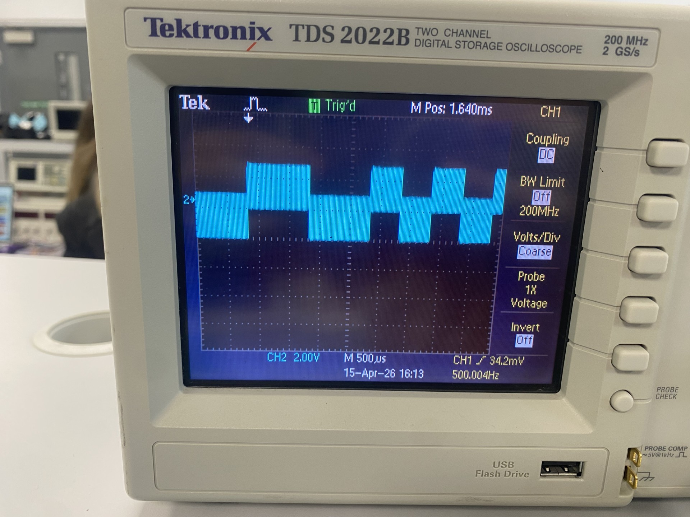

*Figure: BPSK modulated signal at first diode ring output, showing 180° phase reversals at bit boundaries.*

Zooming in to 2.5 µs/div resolves the individual 700 kHz carrier cycles. The waveform is not a perfect wave — it shows the characteristic distortion from diode-ring switching, with slightly triangular peaks and asymmetric half-cycles, matching the SIMetrix prediction for a practical non-linear diode-ring modulator. The carrier period measures approximately 1.43 µs (1/700 kHz).

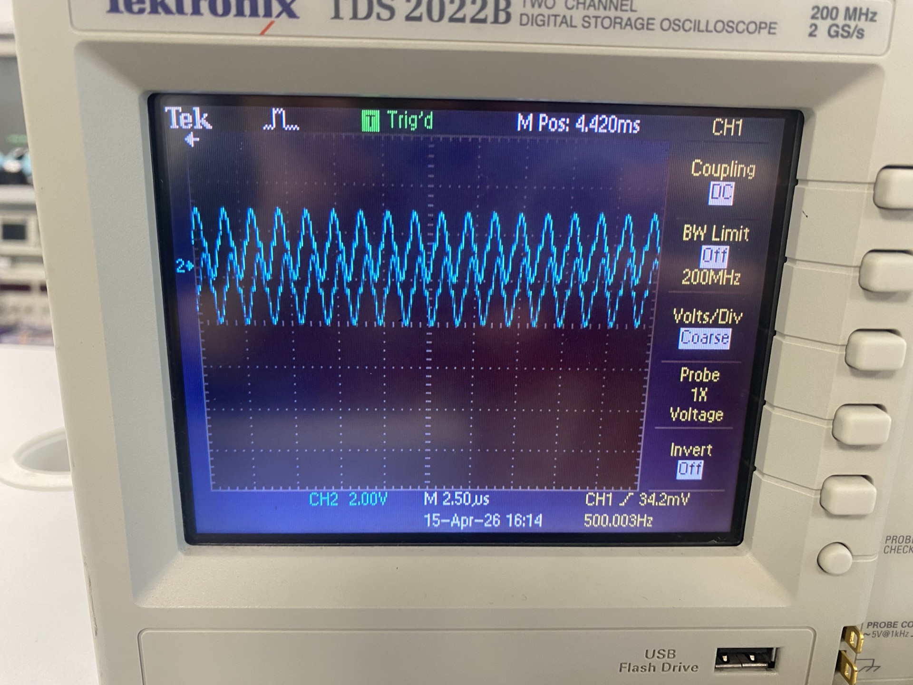

*Figure: BPSK modulated signal zoomed to 2.5 µs/div, showing individual 700 kHz carrier cycles with diode switching distortion.*

### 2.7.3 Comparator Output

The final comparator output (second TL072, pin 1) produces a clean digital waveform switching between positive and negative saturation. The oscilloscope measurements read Pk-Pk = 27.0 V and Max = 13.4 V, which represents the TL072 saturating at approximately ±(15−1.6) V, consistent with the datasheet output voltage swing specification. The on-screen 285.7 Hz Freq measurement and 500 Hz corner reading reflect the scope counting bit-transitions at different averaging windows; neither corresponds directly to the underlying 2 kbps bit rate, which is masked by the long zero-runs in this specific 20-bit pattern. The edges are sharp with no visible ringing, indicating that the bypass capacitors are effectively suppressing high-frequency oscillation, and the recovered bit pattern matches the input TDM sequence perfectly.

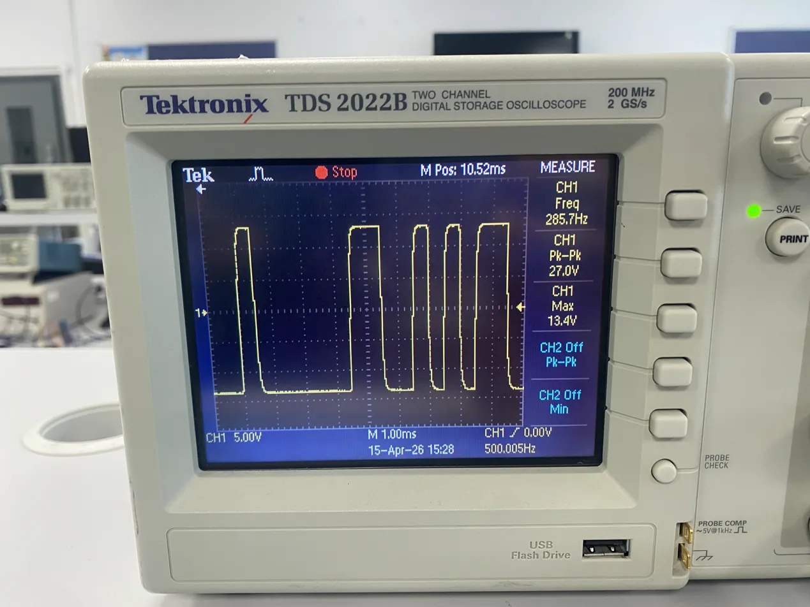

*Figure: Comparator output with oscilloscope measurements: Pk-Pk = 27.0 V, Max = 13.4 V, Freq = 500 Hz.*

### 2.7.4 Baseband signal vs LPF output overlay

A two-channel capture taken between the LPF and comparator stages shows CH1 with a clean digital signal at the bit-rate cadence and CH2 with an intermediate baseband waveform exhibiting distinct voltage levels. The stepped shape on CH2 corresponds to the post-LPF baseband signal before final comparator slicing, similar to the SIMetrix LPF/X2 amplifier output. The CH1 transitions align with the level changes on CH2, indicating that the comparator stage is correctly thresholding the recovered baseband into a clean digital bitstream.

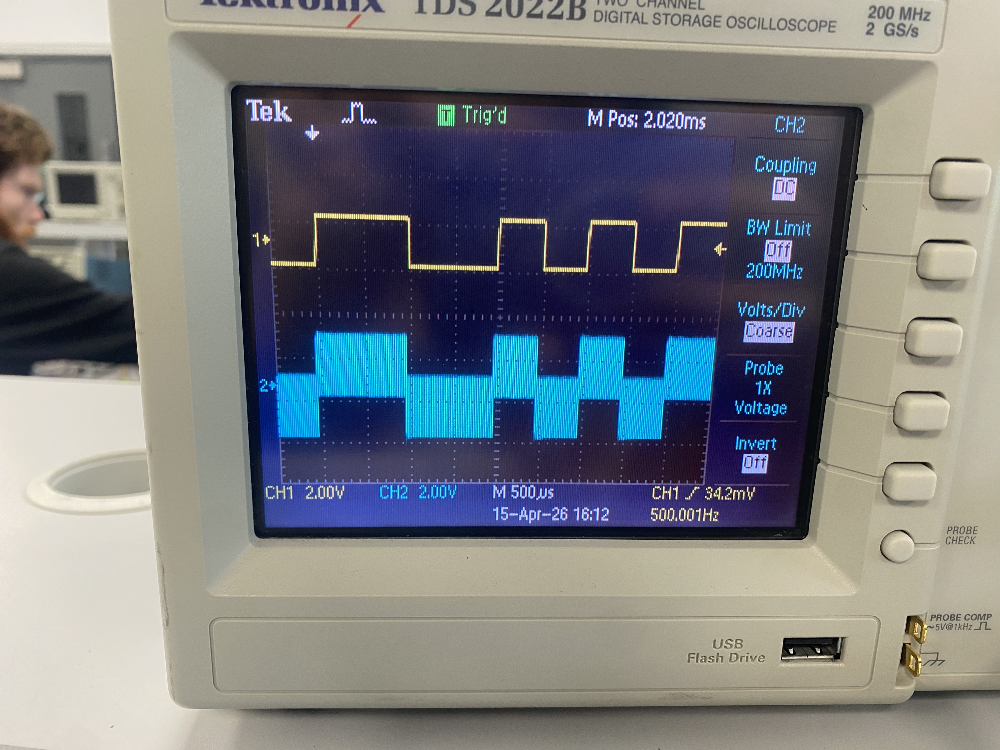

*Figure: Two-channel capture (500 µs/div) — CH1 (yellow) shows the final comparator output; CH2 (cyan) shows the intermediate baseband signal.*

### 2.7.5 Input vs Output Overlay

The two-channel capture shows the comparator output on CH1 alongside the original TDM input on CH2, recorded across the full 10 ms TDM frame. The transitions on the comparator output align with the transitions on the input across the visible bits, indicating that the BPSK chain is recovering the bit pattern correctly through modulation, coherent demodulation, low-pass filtering, and final comparator slicing. The amplitude difference between channels (±1 V input vs the ±13 V comparator swing) reflects the comparator's saturated rail-to-rail output, which was not amplitude-scaled on the breadboard since polarity comparison alone is sufficient to verify correct bit recovery. This confirms end-to-end functional operation of the breadboard implementation, matching the BER = 0/20 result observed in the SIMetrix simulation.

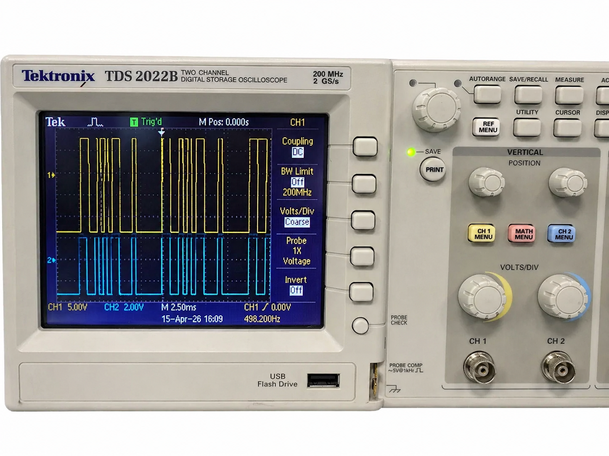

*Figure: BPSK breadboard — comparator output (CH1, yellow, 5 V/div) and original TDM input (CH2, cyan, 2 V/div) captured simultaneously at 2.5 ms/div.*

## 2.8 Breadboard Analysis

The breadboard results confirm that the practical BPSK circuit successfully modulates, transmits, and recovers the 20-bit TDM bitstream using analogue diode-ring modulators and coherent detection. Comparing the input and output overlays, the bit transitions align consistently across all visible TDM slots, confirming end-to-end functional bit recovery. This matches the BER = 0/20 result observed in the SIMetrix simulation, where bit-by-bit comparison was performed against the deterministic PWL input.

Despite real-world impairments not present in simulation (parasitic capacitance, power supply ripple, probe loading, component tolerances), the signal margins remain large enough for error-free recovery.

**Table: Comparison of breadboard and SIMetrix measured values.**

| Parameter                | Breadboard           | SIMetrix          |
|--------------------------|----------------------|-------------------|
| Input message amplitude  | ±1 V                 | ±1 V              |
| Carrier frequency        | 700 kHz              | 700 kHz           |
| Carrier amplitude        | ±5 V (10 Vpp)        | ±5 V              |
| BPSK modulated amplitude | ~±4 V                | ~±3 V             |
| Gain stage output        | ±13.4 V (saturated)  | ±13 V (saturated) |
| Comparator output        | ±13.4 V              | ±13 V             |
| Bit Error Rate           | 0/20 = 0.0000        | 0/20 = 0.0000     |
| Signal inversion         | Yes (from gain stage)| Yes (from gain stage)|

The small difference in BPSK modulated amplitude (~±4 V breadboard vs ~±3 V SIMetrix) is attributed to real-world variation in the 1N4148 forward voltage with temperature and current, which the SIMetrix ideal-diode model does not capture exactly. This does not affect demodulation, since coherent detection depends on carrier phase rather than amplitude.

Overall, the breadboard implementation validates the SIMetrix design. The practical circuit reproduces the same error-free bit recovery achieved in simulation, demonstrating that the diode-ring BPSK modulator and coherent demodulator are robust to real-world component imperfections and noise at the signal levels used.
